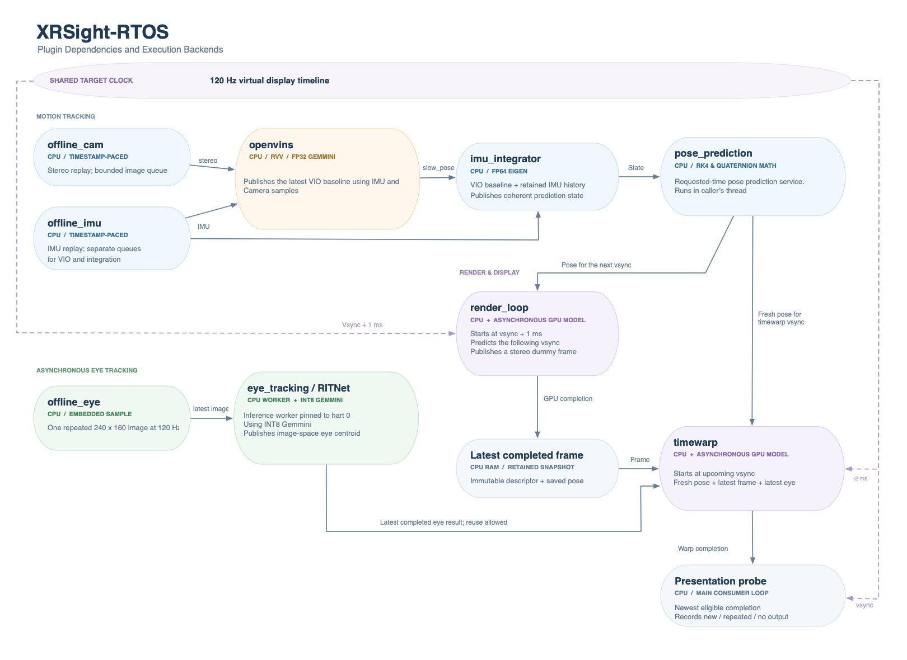

# XRSight-RTOS

XRSight-RTOS brings an ILLIXR-based extended-reality workload to Zephyr RTOS and heterogeneous RISC-V SoCs. It connects sensor traces, pose estimation, rendering schedules, and eye inference to the processor, memory system, and accelerators executing it in cycle-accurate simulation. This is a major revision to [XRSight](https://github.com/ucb-bar/xrsight), which combines [ILLIXR](https://illixr.github.io/ILLIXR/), [Chipyard](https://chipyard.readthedocs.io/), and [FireSim](https://docs.fires.im/) for XR hardware/software co-design. See the [original IISWC 2025 paper](https://ieeexplore.ieee.org/document/11242088) for the project background.

The runtime boots directly as a Zephyr ELF. Tested systems include single-, dual-, and quad-core Rocket, Saturn vector units, FP32 Gemmini for selected OpenBLAS operations, and INT8 Gemmini for RITnet eye inference. Multicore workers execute concurrently and accelerator requests are routed to the hart that owns each array.

Other implementation notes:
The current graphics stages model asynchronous GPU latency and publish **dummy image descriptors**. Timewarp computes a CPU rotational correction, but neither stage runs shaders or produces real rendered pixels. We plan to extend this to GPU memory behavior modeling or the original XRSight blackbox GPU model. RITNet returns an image-space foreground centroid, not a calibrated gaze vector; timewarp records that result without changing its pixels. No desktop renderer or host GPU worker is required for this flow.



## Contents

1. [Updates from XRSight 1.0](#updates-compared-with-xrsight-10)
2. [Building the ELF](#building-the-firesim-elf)
3. [Running on FireSim](#running-on-firesim)
4. [Outputs and Analysis](#outputs-and-analysis)
5. [Included Plugins](#included-plugins)

## Updates from XRSight 1.0

### Embedded RTOS with verified multicore execution

[Zephyr](https://www.zephyrproject.org/) is a configurable real-time operating system for embedded devices. It provides preemptible threads, priorities, timers, mutexes, message queues, drivers, and symmetric multiprocessing (SMP) without requiring a Linux userspace. The application and selected kernel components link into one firmware image. [Chipyard's Zephyr guide](https://chipyard.readthedocs.io/en/latest/software/zephyr/) explains its kernel configuration, device trees, and HTIF integration.

Moving the ILLIXR-based workload from Ubuntu to Zephyr gives us a smaller OS workload and an embedded execution environment closer to a production AR/VR device. It avoids simulating a full Linux boot and userspace services. This makes simulation substantially more practical.

Single-, dual-, and quad-core execution has been validated with Zephyr threads. Generally, plugins that are based on the ILLIXR threadloop instantiate their own threads, while those that offer services (e.g. pose_prediction) are executed on the calling thread. 

### Independent work on a shared target clock

The earlier XRSight deployment used an IMU-sample-aligned global simulation tick to coordinate work around that deployment's Linux/Chipyard concurrency limitations. This was a workaround in that flow that addressed limitations in Linux-Chipyard integration. 

Here, Zephyr schedules independent workers against a shared target clock:

- IMU replay publishes every included sample in timestamp order to two independent queues. 
- Camera replay selects stereo images due by the current target clock, skipping superseded replay opportunities are skipped.
- OpenVINS consumes its camera and IMU queues and publishes a latest VIO baseline. 
- The IMU Integrator (GTSAM) independently consumes IMUs and propagates that baseline.
- Pose prediction is an on-demand service executed in the requesting render/timewarp thread. It reads a coherent integration snapshot and predicts a fast pose for the requested display timestamp.
- Eye inference independently consumes the latest eye image and publishes its latest completed result. 
- Render starts 1 ms after an absolute 120 Hz vsync boundary and targets the following boundary. 
- Timewarp independently starts 2 ms before its upcoming boundary: 1 ms GPU delay plus 1 ms margin. It can warp the same completed frame more than once.

In standalone mode, the render delay is 6.944445 ms and the timewarp delay is 1 ms, and expired opportunities are skipped without catch-up bursts. The main consumer models presentation at each vsync using timestamped completion history. Note that this is modeled presentation, without any real display. See [GPU scheduling](docs/gpu-pipeline.md), [IMU transport](docs/imu-value-transport.md), and [asynchronous eye tracking](docs/eye-tracking.rst).

### Clock settings

| Clock or quantity | Current setting | Meaning |
|---|---|---|
| Generated target CPU/bus clocks | 500 MHz | Chipyard configurations, including `WithPeripheryBusFrequency(500.0)`; these configurations keep the relevant target clocks at the same rate. |
| Generated CLINT timebase | 500 kHz | `WithTimebase(BigInt(500000))`; one `mtime` increment per 1,000 target CPU cycles, or 2 µs under the generated 500 MHz interpretation. |
| Firmware timer declaration | 1 MHz | `CONFIG_SYS_CLOCK_HW_CYCLES_PER_SEC=1000000` in `config/rocket_1ghz.conf`; Zephyr interprets an `mtime` increment as 1 µs. |
| Modeled CPU frequency | 1 GHz | `ILLIXR_CORE_HZ=1000000000`; the same 1,000:1 CPU/timer ratio is interpreted at twice the generated frequency. |
| Zephyr tick rate | 10 kHz | `CONFIG_SYS_CLOCK_TICKS_PER_SEC=10000`: 100 µs timeout units. Tickless operation does not require an interrupt on every tick. |
| Physical U250 clock request | 30 MHz | FPGA implementation constraint, with `NORETIMING`. It is distinct from simulated CPU frequency and achieved simulation throughput. |
| Host elapsed time | Measured wall time | Programming, loading, simulation, export, and analysis take real host time. This is not the application clock. |

From the above settings we can derive how the modeled CPU frequency is 1 GHz: with a peripheral bus frequency of 500 MHz and CLINT timer timebase as 500 kHz, we know that mtime/CLINT increments once per 1000 peripheral-bus cycles. The Zephyr config CONFIG_SYS_CLOCK_HW_CYCLES_PER_SEC specifies that 1 million hardware timer (mtime) increments corresponds to 1 second, yielding 1,000,000 x 1000 = 1 billion cycles/second.

The factor-two interpretation models a 1 GHz operating point on an unchanged bitstream built at 500 MHz target clock; it does not demonstrate physical 1 GHz silicon timing closure. Note that changing the modeled CPU frequency thus requires changing both the periphery bus frequency as well as the timebase. Changing only the CPU label without the timer interpretation would be inconsistent. Spike retains its separate 10 MHz timer configuration and provides functional evidence, not cycle-accurate hardware performance. See [clock experiments](docs/clock-experiments.md) and [baseline settings](docs/current-baseline.md).


## Building the ELF

### Host prerequisites and workspace

This flow is tested on a Linux x86-64 host. 

```bash
git clone https://github.com/pcg108/illixr-rtos.git xrsight-rtos
cd xrsight-rtos
export XRSIGHT_ROOT="$PWD"
export XRSIGHT_WORK="$HOME/xrsight-work"
export CHIPYARD_DIR="$XRSIGHT_WORK/chipyard"
export EUROC_MAV0="$XRSIGHT_WORK/data/V1_02_medium/mav0"
mkdir -p "$XRSIGHT_WORK"
python3 -m venv "$XRSIGHT_WORK/venv"
export XRSIGHT_PYTHON="$XRSIGHT_WORK/venv/bin/python"
"$XRSIGHT_PYTHON" -m pip install --upgrade pip
```

Reproduction uses verified pinned dependencies rather than current branches:

| Dependency | Tested revision/version |
|---|---|
| `ucb-bar/zephyr` | `cd45a528d3bf81f9c7aa2a63f9fe512eee0881b0` (4.1.99) |
| Zephyr SDK / application compiler | SDK 0.17.0, GCC 12.2, matching Newlib and libstdc++ |
| Eigen | `68f4e58cfacc686583d16cff90361f0b43bc2c1b` (3.4.1) |
| OpenCV | `4223495e6cd67011f86b8ecd9be1fa105018f3b1` (4.5.4), with the included Zephyr thread-support patch |
| `zekailin00/OpenBLAS` | `6d12fcab91ebf4de5eb23c1218727d2551b8635e` |
| RVV C compiler | Chipyard `riscv64-unknown-elf-gcc` 13.2.0; exact version checked |

Fetch the pinned software sources and checksummed SDK:

```bash
"$XRSIGHT_PYTHON" "$XRSIGHT_ROOT/scripts/setup_xrsight.py" --work "$XRSIGHT_WORK"
"$XRSIGHT_PYTHON" -m pip install -r "$XRSIGHT_WORK/deps/zephyr/scripts/requirements-base.txt"

export ZEPHYR_TOOLCHAIN_VARIANT=zephyr
export ZEPHYR_SDK_INSTALL_DIR="$XRSIGHT_WORK/deps/zephyr-sdk-0.17.0"
export ZEPHYR_BASE="$XRSIGHT_WORK/deps/zephyr"
unset CROSS_COMPILE
```

The helper calls the existing pinned bootstrap with an explicit workspace, verifies dependency revisions and patches, and writes `$XRSIGHT_WORK/software-dependencies.json`. 

### Dataset and Profiles

Download **EuRoC V1_02_medium, ASL format**, from the [ETH EuRoC dataset page](https://projects.asl.ethz.ch/datasets/euroc-mav/) and its [Research Collection download](https://doi.org/10.3929/ethz-b-000690084). Extract it under `$XRSIGHT_WORK/data/V1_02_medium` so `$EUROC_MAV0` contains `cam0/data.csv`, `cam1/data.csv`, `imu0/data.csv`, and camera `data/` directories. The native accuracy report also uses the sequence's ground-truth data. Preserve the downloaded archive and its checksum. If the download is a collection archive, first extract its nested `V1_02_medium.zip`; the compiler needs the ASL directory layout, not a ROS bag.

```bash
mkdir -p "$XRSIGHT_WORK/data/V1_02_medium"
unzip /absolute/path/to/V1_02_medium.zip -d "$XRSIGHT_WORK/data/V1_02_medium"
test -f "$EUROC_MAV0/cam0/data.csv"
test -f "$EUROC_MAV0/cam1/data.csv"
test -f "$EUROC_MAV0/imu0/data.csv"
```

The CMake build invokes `embed_euroc_data.py` to embed the first **50 stereo pairs and 501 IMUs** directly into the ELF, extending IMUs through the final camera timestamp plus 50 ms. Thus, the target needs no mounted dataset, filesystem, or network. 

RITNet weights and one prequantized 240×160 eye sample are already bundled under `third_party/ritnet`; `offline_eye` republishes this sample instead of embedding an image sequence.

| `YAML_FILE` profile | Included pipeline |
|---|---|
| `profiles/imu.yaml` | IMU + stereo replay, OpenVINS, IMU integration |
| `profiles/gpu_pipeline.yaml` | Above, plus pose prediction, render loop, timewarp |
| `profiles/eye_tracking.yaml` | Above, plus offline eye image and asynchronous RITNet |

Profiles select plugins at build time. Use a new build directory when changing hardware, backend, or profile.

### Backend and Hardware Compatibility

`ILLIXR_LINALG_BACKEND` is a **global CMake choice**. `EIGEN_USE_BLAS` is enabled consistently across application/plugin translation units that share Eigen definitions. Only eligible Eigen operations call BLAS; selecting a backend does not move every operation to an accelerator. OpenVINS is the principal BLAS workload. Existing Eigen decomposition algorithms and FP64 estimator storage remain in place.

| Setting | Execution | Required hardware |
|---|---|---|
| `eigen` (default) | CPU Eigen using the scalar application ISA | Rocket with scalar FP64 |
| `openblas_scalar` | Static, single-threaded `RISCV64_GENERIC` OpenBLAS | Rocket with scalar FP64 |
| `openblas_rvv` | `RISCV64_ZVL256B` RVV OpenBLAS | Saturn REFV256D128, VLEN 256, FP64, vector context support |
| `openblas_gemmini_fp32` | FP32 Gemmini for real GEMM/GEMV; accepted RVV OpenBLAS for other supported operations | Saturn plus FP32 Gemmini on hart 0 |

The Gemmini backend is **mixed precision**: DGEMM/DGEMV receive doubles, convert/pack into FP32, compute in FP32, and widen/write the result into the caller's layout. This does not preserve FP64 multiplication/accumulation. The native acceptance bound remains 1 mm / 0.001 rad.

| Chipyard hardware family | Core counts provided | Linear algebra choices | Eye profile |
|---|---|---|---|
| Rocket | 1, 2, 4 | Eigen, scalar OpenBLAS | No |
| Rocket + Saturn | 1, 4 | Eigen, scalar or RVV OpenBLAS | No |
| Rocket + Saturn + FP32 Gemmini | 1, 4 | All four | No |
| Rocket + Saturn + INT8 Gemmini | 1, 4 | Eigen, scalar or RVV OpenBLAS | Yes |
| Rocket + Saturn + FP32 + INT8 Gemmini | 1, 4 | All four | Yes |

These rows describe compatibility, not a claim that every possible profile/backend combination has been benchmarked. Plain Rocket SMP, scalar/RVV OpenBLAS, corrected single/quad accelerator images, and the eye-tracking matrix have separate [validation reports](docs/reproducibility-validation.md). No dual-core Saturn configuration is provided here.

FP32 Gemmini uses custom3, a 4×4 array, 32 KiB scratchpad and 8 KiB accumulators. INT8 Gemmini uses custom2, a 16×16 array, 256 KiB scratchpad and 64 KiB accumulators. Both attach only to hart 0. Each has its own priority-5 worker; only that worker issues its array's instructions. FP32 calls use a globally serialized, aligned 32 MiB BLAS arena. RITNet has separate static activations and publishes results asynchronously. There is no selectable production CPU/RVV eye-inference backend; its CPU implementation is a validation reference.

Render/timewarp always use CPU scheduling/math plus the GPU latency model. Their CMake delay settings are not real GPU backend selectors.

### Example A: single-core Rocket, Eigen, complete GPU-model pipeline

```bash
export ZEPHYR_BASE="$XRSIGHT_WORK/deps/zephyr"
export XRSIGHT_BUILD="$XRSIGHT_WORK/build/rocket-single-eigen"
cmake -S "$XRSIGHT_ROOT" -B "$XRSIGHT_BUILD" -G Ninja \
  -DBOARD=chipyard_riscv64 -DCMAKE_BUILD_TYPE=Release \
  -DPYTHON_EXECUTABLE="$XRSIGHT_PYTHON" -DPython3_EXECUTABLE="$XRSIGHT_PYTHON" \
  -DZEPHYR_MODULES= \
  "-DEXTRA_CONF_FILE=$XRSIGHT_ROOT/config/rocket_single.conf;$XRSIGHT_ROOT/config/rocket_1ghz.conf" \
  -DDTC_OVERLAY_FILE="$XRSIGHT_ROOT/config/rocket_single.overlay" \
  -DOPENCV_SRC_DIR="$XRSIGHT_WORK/deps/opencv" \
  -DYAML_FILE="$XRSIGHT_ROOT/profiles/gpu_pipeline.yaml" \
  -DILLIXR_DATASET_DIR="$EUROC_MAV0" -DILLIXR_DATASET_FRAMES=50 \
  -DILLIXR_CORE_HZ=1000000000 -DILLIXR_PIN_PLUGINS=OFF \
  -DILLIXR_LINALG_BACKEND=eigen
cmake --build "$XRSIGHT_BUILD" --parallel 4
```

For dual or quad plain Rocket, replace **both** `rocket_single.conf` and `rocket_single.overlay` with `rocket_dual` or `rocket_quad`. Core count and interrupt topology are compiled into the ELF; do not reuse a single-core ELF to claim multicore validation.

### Vector setup and OpenBLAS archives

Vector builds use an isolated Zephyr copy with the included SDK multilib-selection patch. It keeps application/kernel C on the correct RV64/lp64d SDK runtime while enabling explicit vector context assembly. This is not a scheduler-policy change.

```bash
"$XRSIGHT_PYTHON" "$XRSIGHT_ROOT/scripts/setup_xrsight.py" --work "$XRSIGHT_WORK" --vector
export XRSIGHT_RVV_CC="$CHIPYARD_DIR/.conda-env/riscv-tools/bin/riscv64-unknown-elf-gcc"
export XRSIGHT_SYSROOT="$ZEPHYR_SDK_INSTALL_DIR/riscv64-zephyr-elf/riscv64-zephyr-elf"
"$XRSIGHT_RVV_CC" --version
```

Set up Chipyard as described below before using its compiler. The archive builder enforces the pinned compiler, `lp64d`, medany, Zephyr/Newlib headers, and no fast-math. All archives are static and single-threaded, use the standard 32-bit BLAS integer interface, and exclude desktop initialization/autodetection, OpenMP, LAPACK and LAPACKE. Retain the **whole archive build directory**, including its adjacent `manifest.json` and generated headers; CMake verifies their identity.

Build scalar OpenBLAS:

```bash
"$XRSIGHT_PYTHON" "$XRSIGHT_ROOT/scripts/build_openblas.py" \
  --source "$XRSIGHT_WORK/openblas-source" \
  --build "$XRSIGHT_WORK/blas/openblas_scalar" \
  --cc "$ZEPHYR_SDK_INSTALL_DIR/riscv64-zephyr-elf/bin/riscv64-zephyr-elf-gcc" \
  --sysroot "$XRSIGHT_SYSROOT" --backend openblas_scalar --jobs 4
```

To use it, add `-DILLIXR_LINALG_BACKEND=openblas_scalar` and `-DILLIXR_OPENBLAS_ARCHIVE="$XRSIGHT_WORK/blas/openblas_scalar/lib/libopenblas-zephyr.a"` to the CPU example. For RVV, build with `--backend openblas_rvv --cc "$XRSIGHT_RVV_CC"`, use a separate archive directory, and select the vector Zephyr, `config/vector.conf`, and a matching `rocket_single_rvv.overlay` or `rocket_quad_rvv.overlay`.

### Example B: quad-core Saturn + both Gemmini arrays, eye tracking, RVV packing

First elaborate the corresponding hardware configuration as described in [Running on FireSim](#running-on-firesim). Set `XRSIGHT_FP32_HEADER` to its generated `gemmini_params_illixr.h`; verify the generated `gemmini_params_illixr_int8.h` matches the bundled RITNet parameters. Do not substitute a header from a different accelerator geometry.

```bash
"$XRSIGHT_PYTHON" "$XRSIGHT_ROOT/scripts/build_openblas.py" \
  --source "$XRSIGHT_WORK/openblas-source" \
  --build "$XRSIGHT_WORK/blas/openblas_gemmini_fp32" \
  --cc "$XRSIGHT_RVV_CC" --sysroot "$XRSIGHT_SYSROOT" \
  --backend openblas_gemmini_fp32 --gemmini-params "$XRSIGHT_FP32_HEADER" --jobs 4

export ZEPHYR_BASE="$XRSIGHT_WORK/vector-deps/zephyr"
export XRSIGHT_BUILD="$XRSIGHT_WORK/build/quad-eye-rvvpack"
cmake -S "$XRSIGHT_ROOT" -B "$XRSIGHT_BUILD" -G Ninja \
  -DBOARD=chipyard_riscv64 -DCMAKE_BUILD_TYPE=Release \
  -DPYTHON_EXECUTABLE="$XRSIGHT_PYTHON" -DPython3_EXECUTABLE="$XRSIGHT_PYTHON" \
  -DZEPHYR_MODULES= \
  "-DEXTRA_CONF_FILE=$XRSIGHT_ROOT/config/rocket_quad.conf;$XRSIGHT_ROOT/config/rocket_1ghz.conf;$XRSIGHT_ROOT/config/vector.conf" \
  -DDTC_OVERLAY_FILE="$XRSIGHT_ROOT/config/rocket_quad_rvv.overlay" \
  -DOPENCV_SRC_DIR="$XRSIGHT_WORK/deps/opencv" \
  -DYAML_FILE="$XRSIGHT_ROOT/profiles/eye_tracking.yaml" \
  -DILLIXR_DATASET_DIR="$EUROC_MAV0" -DILLIXR_DATASET_FRAMES=50 \
  -DILLIXR_CORE_HZ=1000000000 -DILLIXR_PIN_PLUGINS=OFF \
  -DILLIXR_LINALG_BACKEND=openblas_gemmini_fp32 \
  -DILLIXR_OPENBLAS_ARCHIVE="$XRSIGHT_WORK/blas/openblas_gemmini_fp32/lib/libopenblas-zephyr.a" \
  -DILLIXR_GEMMINI_PACKING=rvv -DILLIXR_GEMMINI_PACKING_TRAVERSAL=rows \
  -DILLIXR_PACKING_SATURN_COMPAT=ON -DILLIXR_RITNET_DIAGNOSTICS=OFF
cmake --build "$XRSIGHT_BUILD" --parallel 4
```

`ILLIXR_GEMMINI_PACKING=scalar` remains the default. Explicit RVV packing fuses conversion with packing and supports signed strides/tails without rebuilding temporary arrays element by element in scalar C++. `rows` is the traversal tested in the complete FPGA pipeline; `contiguous` has standalone equivalence/benchmark evidence. The accepted Saturn images require explicit `ILLIXR_PACKING_SATURN_COMPAT=ON` for the tested RVV conversion path. Scalar packing still requires Saturn for the backend's other BLAS operations.

For a single-core equivalent, change the quad configuration/overlay to their single-core versions and use the single-core dual-array image. For FP32-only hardware, select `profiles/gpu_pipeline.yaml`. For INT8-only hardware, keep the eye profile and select Eigen, scalar OpenBLAS, or RVV OpenBLAS instead of FP32 Gemmini.

### Build outputs and preflight

The firmware is `$XRSIGHT_BUILD/zephyr/zephyr.elf`. Preserve `.config`, `zephyr.dts`, `CMakeCache.txt`, generated dataset headers/manifest, the OpenBLAS build manifest, and hardware header hashes with each ELF. The tested quad eye firmware occupies approximately 194 MiB of RAM sections within the 256 MiB target; inspect each new link's memory report rather than assuming it fits.

Build a **separate** preflight directory with the same arguments plus `-DILLIXR_PLATFORM_CHECK_ONLY=ON`. Preflight checks configured harts, atomics, timer progression, enabled vector state, and backend self-tests before exiting through HTIF. The required startup masks are `0x1`, `0x3`, and `0xF`. A failed preflight blocks that image's full workload. The platform-only ELF exits before starting plugins and therefore does not run RITNet inference. Standalone accelerator fixtures provide that additional coverage; full eye-enabled workloads must also pass the eye checks described below. See [Gemmini validation](docs/gemmini-openblas.md) and [eye tracking validation](docs/eye-tracking.rst).

The default production profile retains batched trace export, all-operation RITNet fences, the 50 ms prediction horizon/stale policy, camera queue capacity 8, and independent 4,096-record IMU queues. The examples do not change estimator initialization, calibration, or queue policies.

## Running on FireSim

### Pinned source checkout and host setup

The hardware manifest is [config/firesim/manifest.json](config/firesim/manifest.json). The published component repositories retain upstream history and licenses. Chipyard, Rocket, Saturn, and Shuttle repositories are public; HTTPS access does not require a GitHub account.

| Repository | Required revision |
|---|---|
| `pcg108/chipyard`, branch `fix/rocket-saturn-shuttle-rtl` | `621472a27a3ec8ce53af19af3b5e03fb96309d0c` |
| `pcg108/rocket-chip` | `2c0e4784c46f1a67ef39699c7d67aef65e3ea8c0` |
| `pcg108/saturn-vectors` | `9e04c8c6c70a4b4db5989f9a16a89679183a5d1d` |
| `pcg108/shuttle` | `e789aa207148ade9eaed79f12841102597f5a0a5` |
| `pcg108/firesim`, tested `trafficgen-xdma` base | `fa08b6cae659f88d00efb1a2d8c71be85aed97f8` |
| Existing Gemmini project | `69a1c0383283d6ac95c99d2e53136fef4b0bb67e` |
| Namespaced stock Gemmini source for these arrays | `8c3f9923a44a2fe2c7930587be297d6d4f8c09ca` |

The parent revision pins the corrected CPU/vector components, but its FireSim pointer is **not** the FireSim revision used by the accepted FPGA images. Select that dependency explicitly:

```bash
git clone --branch fix/rocket-saturn-shuttle-rtl \
  https://github.com/pcg108/chipyard.git "$CHIPYARD_DIR"
git -C "$CHIPYARD_DIR" checkout --detach 621472a27a3ec8ce53af19af3b5e03fb96309d0c
cd "$CHIPYARD_DIR"
# Requires the normal Chipyard host/Conda prerequisites.
# Skip optional indexing, precompilation, FireSim, FireMarshal, and cleanup here.
# Use HTTPS for the public component URLs stored as SSH in the pinned .gitmodules.
GIT_CONFIG_COUNT=1 \
GIT_CONFIG_KEY_0=url.https://github.com/pcg108/.insteadOf \
GIT_CONFIG_VALUE_0=git@github.com:pcg108/ \
./build-setup.sh -s 4 -s 5 -s 6 -s 7 -s 8 -s 9 -s 11
git submodule update --init sims/firesim
git -C sims/firesim fetch https://github.com/pcg108/firesim.git fa08b6cae659f88d00efb1a2d8c71be85aed97f8
git -C sims/firesim checkout --detach fa08b6cae659f88d00efb1a2d8c71be85aed97f8
./scripts/firesim-setup.sh
git -C generators/gemmini fetch https://github.com/ucb-bar/gemmini.git 8c3f9923a44a2fe2c7930587be297d6d4f8c09ca

"$XRSIGHT_PYTHON" "$XRSIGHT_ROOT/scripts/setup_firesim.py" install \
  --chipyard "$CHIPYARD_DIR"
```

Do this in the isolated checkout, before elaboration. The installer verifies pinned revisions, checks file hashes, applies only the packaged patches, installs the Scala configurations, and creates the deterministic `illixr_fp32_gemmini` namespace. It is idempotent and refuses conflicting local files. `install --check` performs the revision/conflict check without writing. It does not fetch revisions or change Git branches for you.

The additional patches provide streaming FIRRTL emission, correct unsigned 64-bit handling of the 100-billion-cycle limit, and U250 build-worker/report handling. They are build/host support, separate from the five published RTL fixes. Unrelated TrafficGen changes are not imported.

Complete the [FireSim local FPGA host setup](https://docs.fires.im/en/latest/local-fpga-initial-setup/) and [U250 setup](https://docs.fires.im/en/latest/getting-started-guides/on-premises-fpga-getting-started/initial-setup/xilinx-alveo-u250/) for XDMA, device discovery, SSH to localhost, and FPGA permissions. Retain Vivado 2022.1 for the tested flow and use host tooling from the pinned checkout; the linked latest documentation may describe newer releases. Board provisioning or driver installation may require your host administrator; the project helpers do not perform those system changes.

```bash
cd "$CHIPYARD_DIR/sims/firesim"
source sourceme-manager.sh
export XRSIGHT_DEPLOY="$CHIPYARD_DIR/sims/firesim/deploy"
export XRSIGHT_FPGA_DB=/absolute/path/to/your/discovered-fpga-db.json
```

Use the FPGA database generated for **your board**, selecting one U250. Do not copy another machine's PCI address or serial number. The following flow assumes the FPGA has already been provisioned for FireSim.

### Recovering from the missing Conda lockfile error

The earlier Chipyard pin (`974da28f4`) omitted the full Conda lockfile. The current pin packages it and checks for missing lockfiles before creating environments. Its Conda step was validated in an isolated checkout with both environment directories initially absent; package caches were available. GCC 13.2.0 and an FP64 RVV compilation check passed. This does not establish validation of every later README command from scratch.

If your old setup printed `conda-lock install` usage and failed at step 1, update the checkout and preserve the partially created environments before retrying. Run this from the affected Chipyard checkout, with Conda available:

```bash
set -e
git fetch origin fix/rocket-saturn-shuttle-rtl
git checkout --detach 621472a27a3ec8ce53af19af3b5e03fb96309d0c
source "$(conda info --base)/etc/profile.d/conda.sh"
conda activate base
conda_setup_backup=$(mktemp -d "$PWD/conda-setup-backup.XXXXXX")
for directory in .conda-lock-env .conda-env; do
  if [ -d "$directory" ]; then
    mv "$directory" "$conda_setup_backup/"
  fi
done
GIT_CONFIG_COUNT=1 \
GIT_CONFIG_KEY_0=url.https://github.com/pcg108/.insteadOf \
GIT_CONFIG_VALUE_0=git@github.com:pcg108/ \
./build-setup.sh -s 4 -s 5 -s 6 -s 7 -s 8 -s 9 -s 11
```

The backup retains the old environment files for inspection; relocated Conda environments should not be used as working installations. The full lockfile preserves the development environment's resolved package set, including host sysroot 2.34. Chipyard's existing host-glibc-triggered lockfile regeneration remains unchanged; a regenerated lockfile represents a different solve.

The installer also removes an optional TrafficGen trace dependency from the pinned FireChip sources. It also excludes unused TrafficGen driver sources and Boost serialization from XRSight host-driver builds. XRSight does not use this instrumentation; the clean pinned inclusive-cache lacks its parameter. If elaboration reports `InclusiveCacheTrafficGenTraceCycles` missing, update this repository and rerun the installer before retrying. See [the packaging notes](config/firesim/README.md#optional-trafficgen-trace-dependency). No Chipyard revision change is required.

### Hardware configurations

`setup_firesim.py configure --help` lists the aliases. Choose one and retain that choice through elaboration, firmware, bitstream packaging, and runtime setup.

| Hardware | Single-core class | Multicore class |
|---|---|---|
| Rocket | `FireSimILLIXRSingleRocketConfig` | `FireSimILLIXRDualRocketConfig`, `FireSimILLIXRQuadRocketConfig` |
| Rocket + Saturn | `FireSimILLIXRSingleRocketSaturnConfig` | `FireSimILLIXRQuadRocketSaturnConfig` |
| + FP32 Gemmini | `FireSimILLIXRSingleRocketGemminiSaturnConfig` | `FireSimILLIXRQuadRocketGemminiSaturnConfig` |
| + INT8 Gemmini | `FireSimILLIXRSingleRocketInt8GemminiSaturnConfig` | `FireSimILLIXRQuadRocketInt8GemminiSaturnConfig` |
| + both Gemmini arrays | `FireSimILLIXRSingleRocketDualGemminiSaturnConfig` | `FireSimILLIXRQuadRocketDualGemminiSaturnConfig` |

The corresponding aliases are `illixr_u250_rocket_{single,dual,quad}`, and `illixr_u250_rocket_{saturn,gemmini_saturn,int8_gemmini_saturn,dual_gemmini_saturn}_{single,quad}`. Braces here describe alternatives; choose a single literal alias. The manifest also retains the separately investigated single/quad Shuttle+Saturn configurations; the primary instructions and accepted heterogeneous workload path use Rocket.

All listed Rocket targets retain 256 MiB RAM, HTIF/TSI loading and exit, the 500 MHz/500 kHz generated ratio, default FireSim bridges without TracerV, and the tested FASED latency-bandwidth model. Saturn configurations use REFV256D128 on every hart.

### Elaborate and build the selected image

Prepare build-only files before an ELF exists. The canonical example is quad-core dual Gemmini:

```bash
export XRSIGHT_HW=illixr_u250_rocket_dual_gemmini_saturn_quad
export XRSIGHT_HW_WORK="$XRSIGHT_WORK/hardware/$XRSIGHT_HW"
"$XRSIGHT_PYTHON" "$XRSIGHT_ROOT/scripts/setup_firesim.py" configure \
  --chipyard "$CHIPYARD_DIR" --work "$XRSIGHT_HW_WORK" \
  --config "$XRSIGHT_HW" --build-only
```

The renderer writes complete manager files with absolute paths, plus `commands.json` identifying the matching elaboration command, generated RTL, staging directory, and accelerator headers. Templates live in [config/firesim](config/firesim). They use JSON syntax, which is valid YAML; FireSim accepts these `.yaml` files directly. YAML does not expand shell variables.

The build recipe has this structure (the helper replaces `/ABS/...` with your paths):

```yaml
illixr_u250_rocket_dual_gemmini_saturn_quad:
  PLATFORM: xilinx_alveo_u250
  TARGET_PROJECT: firesim
  TARGET_PROJECT_MAKEFRAG: /ABS/chipyard/generators/firechip/chip/src/main/makefrag/firesim
  DESIGN: FireSim
  TARGET_CONFIG: FireSimILLIXRQuadRocketDualGemminiSaturnConfig
  PLATFORM_CONFIG: BaseXilinxAlveoU250Config
  deploy_quintuplet: null
  platform_config_args:
    fpga_frequency: 30
    build_strategy: NORETIMING
  post_build_hook: null
  metasim_customruntimeconfig: null
  bit_builder_recipe: /ABS/chipyard/sims/firesim/deploy/bit-builder-recipes/xilinx_alveo_u250.yaml
```

`config_build.yaml` selects that alias in `builds_to_run`, an externally provisioned localhost build farm, and a private build directory. Use at most four workers. The supplied guard enforces a 48 GiB available-memory reserve, 64 GiB per-process RSS ceiling, and stop on a new kernel OOM kill; memory PSI is warning-only. A guard stop preserves artifacts and leaves a latch. It never silently restarts or relaxes limits. Build cleanup checks the guard's ownership tag, descendant relationships, and process identities; sharing a directory does not make another job eligible for cleanup.

Run elaboration without synthesis first:

```bash
cd "$CHIPYARD_DIR/sims/firesim"
set -o pipefail
"$XRSIGHT_PYTHON" "$XRSIGHT_ROOT/scripts/firesim_resource_guard.py" \
  --scratch "$XRSIGHT_WORK" --run-dir "$XRSIGHT_HW_WORK/elaboration-guard" \
  --latch "$XRSIGHT_HW_WORK/elaboration-stopped.json" --jobs 4 -- \
  make -C "$CHIPYARD_DIR/sims/firesim/sim" \
    PLATFORM=xilinx_alveo_u250 TARGET_PROJECT=firesim \
    TARGET_PROJECT_MAKEFRAG="$CHIPYARD_DIR/generators/firechip/chip/src/main/makefrag/firesim" \
    DESIGN=FireSim TARGET_CONFIG=FireSimILLIXRQuadRocketDualGemminiSaturnConfig \
    PLATFORM_CONFIG=BaseXilinxAlveoU250Config verilog \
  2>&1 | tee "$XRSIGHT_HW_WORK/elaboration.log"
```

For another alias, use its exact `TARGET_CONFIG` from the table or the command array in `commands.json`. Set the generated paths from that file; for this example:

```bash
export XRSIGHT_STAGING="$CHIPYARD_DIR/sims/firesim-staging/generated-src/firechip.chip.FireSim.FireSimILLIXRQuadRocketDualGemminiSaturnConfig"
export XRSIGHT_RTL="$CHIPYARD_DIR/sims/firesim/sim/generated-src/xilinx_alveo_u250/xilinx_alveo_u250-firesim-FireSim-FireSimILLIXRQuadRocketDualGemminiSaturnConfig-BaseXilinxAlveoU250Config/FireSim-generated.sv"
export XRSIGHT_FP32_HEADER="$CHIPYARD_DIR/gemmini_params_illixr.h"
"$XRSIGHT_PYTHON" "$XRSIGHT_ROOT/scripts/check_firesim_platform.py" \
  --chipyard "$CHIPYARD_DIR" --config "$XRSIGHT_HW" \
  --staging-dir "$XRSIGHT_STAGING" --rtl "$XRSIGHT_RTL" \
  --elaboration-log "$XRSIGHT_HW_WORK/elaboration.log" --elaboration-only \
  --output "$XRSIGHT_HW_WORK/platform.json"
```

This checks generated harts, ISA/vector geometry, memory/interrupt maps, clock bridges, boot ROM, accelerator instances and headers, FASED limits, and HTIF host settings. It is **not** routed-timing or FPGA-run acceptance. Now build the matching preflight and workload ELFs using the earlier CMake examples.

Package each firmware build for the runner and analyzers:

```bash
export XRSIGHT_FIRMWARE="$XRSIGHT_WORK/artifacts/quad-eye-rvvpack"
"$XRSIGHT_PYTHON" "$XRSIGHT_ROOT/scripts/package_firmware.py" \
  --build "$XRSIGHT_BUILD" --deps "$XRSIGHT_WORK/vector-deps" \
  --platform "$XRSIGHT_HW_WORK/platform.json" --output "$XRSIGHT_FIRMWARE"
```

Use `--deps "$XRSIGHT_WORK/deps"` for scalar Zephyr builds. The helper records compiled settings, firmware/source/dependency hashes, dataset identity, memory/ELF reports, backend identity, and the BLAS symbol audit. It refuses an existing destination. Package the separate preflight build in its own artifact directory too.

Build the FPGA image from the prepared recipes:

```bash
cd "$XRSIGHT_DEPLOY"
# python3 here is the Python from the sourced FireSim manager environment.
"$XRSIGHT_PYTHON" "$XRSIGHT_ROOT/scripts/firesim_resource_guard.py" \
  --scratch "$XRSIGHT_WORK" --run-dir "$XRSIGHT_HW_WORK/build-guard" \
  --latch "$XRSIGHT_HW_WORK/build-stopped.json" --jobs 4 -- \
  python3 "$XRSIGHT_ROOT/scripts/firesim_manager.py" --chipyard "$CHIPYARD_DIR" -- \
    buildbitstream -b "$XRSIGHT_HW_WORK/config_build.yaml" \
    -r "$XRSIGHT_HW_WORK/config_build_recipes.yaml" \
    -a "$XRSIGHT_HW_WORK/config_hwdb_build.yaml"
```

This wrapper invokes the normal `firesim buildbitstream` manager while forwarding resource-ownership metadata to localhost build workers. Keep generated files and temporary build products in the isolated checkout/workspace. Use a separate Chipyard tree for each hardware configuration: generated accelerator header names are shared within a checkout. Do not lower Saturn/Gemmini parameters or change timing constraints automatically after a failed build.

### Timing, driver packaging, and HWDB

FireSim writes a proposed entry under `deploy/built-hwdb-entries/` and results under `deploy/results-build/`. The local build directory contains `cl_<deploy-quintuplet>/firesim.tar.gz`, `driver/`, and `vivado_proj/`. Locate it under the rendered build directory (for example with `find "$XRSIGHT_HW_WORK/builds" -name firesim.tar.gz`). Select that exact directory and its matching post-route bus-skew report:

```bash
export XRSIGHT_BUILD_OUTPUT=/absolute/path/to/cl_xilinx_alveo_u250-firesim-FireSim-FireSimILLIXRQuadRocketDualGemminiSaturnConfig-BaseXilinxAlveoU250Config
export XRSIGHT_BUS_SKEW_REPORT="$XRSIGHT_BUILD_OUTPUT/vivado_proj/firesim.runs/impl_1/overall_fpga_top_bus_skew_postroute_physopted.rpt"
export XRSIGHT_HARDWARE="$XRSIGHT_HW_WORK/hardware.json"
"$XRSIGHT_PYTHON" "$XRSIGHT_ROOT/scripts/check_firesim_platform.py" \
  --chipyard "$CHIPYARD_DIR" --config "$XRSIGHT_HW" \
  --staging-dir "$XRSIGHT_STAGING" --rtl "$XRSIGHT_RTL" \
  --elaboration-log "$XRSIGHT_HW_WORK/elaboration.log" \
  --build-output "$XRSIGHT_BUILD_OUTPUT" --bus-skew-report "$XRSIGHT_BUS_SKEW_REPORT" \
  --firmware "$XRSIGHT_FIRMWARE" --output "$XRSIGHT_HARDWARE"
python3 "$XRSIGHT_ROOT/scripts/setup_firesim.py" package-driver \
  --chipyard "$CHIPYARD_DIR" --hardware "$XRSIGHT_HARDWARE" \
  --output-dir "$XRSIGHT_HW_WORK/packages"
```

The checker requires final routed timing closure and complete routing; synthesis success or manager exit alone is insufficient. It also hashes the bitstream archive, driver, headers, boot ROM, and generated descriptions. The driver packager preserves the matching driver, its host shared libraries, and the tested runtime configuration. A FireSim bitstream archive is more than a raw `.bit` file.

`configure --hardware-manifest` then writes the HWDB entry automatically:

```yaml
illixr_u250_rocket_dual_gemmini_saturn_quad:
  bitstream_tar: file:///ABS/firesim.tar.gz
  driver_tar: file:///ABS/driver-bundle.tar.gz
  deploy_quintuplet_override: xilinx_alveo_u250-firesim-FireSim-FireSimILLIXRQuadRocketDualGemminiSaturnConfig-BaseXilinxAlveoU250Config
  custom_runtime_config: illixr-quad-runtime.conf
```

Keep bitstream and driver from the same build. The tested runtime configuration uses:

```text
+mm_readLatency_0=30
+mm_writeLatency_0=30
+mm_readMaxReqs_0=10
+mm_writeMaxReqs_0=10
+mm_useHardwareDefaultRuntimeSettings_0
+fesvr-step-size=10000
+idle-counts=1
+fesvr-wait-ticks=8
```

The value 16 is invalid for the compiled four-bit outstanding-request fields; it previously blocked memory traffic. FASED timing also differs from Verilator's DRAMSim2, so cross-simulator performance comparisons must identify the memory model.

### Runtime configuration, programming, and execution

Use a new run directory and unique workload name for every preflight or workload. First set `XRSIGHT_FIRMWARE` to the packaged **preflight**; repeat the same steps with the full workload only after the preflight passes.

```bash
export XRSIGHT_RUN="$XRSIGHT_WORK/runs/quad-eye-preflight-1"
"$XRSIGHT_PYTHON" "$XRSIGHT_ROOT/scripts/setup_firesim.py" configure \
  --chipyard "$CHIPYARD_DIR" --work "$XRSIGHT_RUN" --config "$XRSIGHT_HW" \
  --elf "$XRSIGHT_FIRMWARE/zephyr.elf" --fpga-db "$XRSIGHT_FPGA_DB" \
  --hardware-manifest "$XRSIGHT_HARDWARE" --workload-name quad-eye-preflight-1
```

This writes `config_runtime.yaml`, `config_hwdb.yaml`, the recipe files, `case.json`, and the bare-metal workload JSON. It installs conflict-checked workload links under FireSim's `deploy/workloads/`. The generated runtime selects:

- Externally provisioned localhost with one U250 and an explicit FPGA database.
- `default_simulation_dir: <run>/runfarm`, one no-network target, and the selected HWDB alias.
- `profile_interval: 1000000` and `+max-cycles=100000000000`.
- Tracing disabled, DRAM zeroing enabled, and synthesized assertions enabled.
- The generated workload JSON, whose `common_bootbinary` is `zephyr.elf`, `common_rootfs` is `null`, and simulation outputs include `uartlog` and `memory_stats0.csv`.

The complete [runtime template](config/firesim/config_runtime.yaml.in) shows every field. No FireMarshal Linux disk image is involved: FireSim's TSI/loadmem path loads the ELF, including its embedded sensor samples.

Hold the same host-wide advisory lock across programming and execution. All users of the shared board should agree on its path. Also inspect the board's idle state; a lock alone cannot detect unrelated software that does not use it.

```bash
set -e
export XRSIGHT_FPGA_LOCK=/tmp/xrsight-u250.lock
exec 9>"$XRSIGHT_FPGA_LOCK"
flock -n 9
"$XRSIGHT_PYTHON" - "$XRSIGHT_ROOT" "$XRSIGHT_FPGA_DB" <<'PY'
import pathlib, sys
sys.path.insert(0, str(pathlib.Path(sys.argv[1]) / 'scripts'))
from run_firesim_matrix import assert_board_free
print(assert_board_free(pathlib.Path(sys.argv[2])))
PY
cd "$XRSIGHT_DEPLOY"
firesim infrasetup -c "$XRSIGHT_RUN/config_runtime.yaml" \
  -a "$XRSIGHT_RUN/config_hwdb.yaml" -r "$XRSIGHT_RUN/config_build_recipes.yaml"
"$XRSIGHT_PYTHON" "$XRSIGHT_ROOT/scripts/collect_firesim_results.py" record \
  --manager-dir "$XRSIGHT_DEPLOY" --runtime-dir "$XRSIGHT_RUN" \
  --execution "$XRSIGHT_RUN/execution.json" --timeout 86400 -- \
  firesim runworkload -c "$XRSIGHT_RUN/config_runtime.yaml" \
    -a "$XRSIGHT_RUN/config_hwdb.yaml" -r "$XRSIGHT_RUN/config_build_recipes.yaml"
flock -u 9
exec 9>&-
```

Run this block in a shell with `set -e` so a failed lock, idle check, or programming step stops execution. The recorder preserves the manager result, watchdog outcome, and host runtime. Timeout cleanup targets only processes belonging to this run's private directory; it does not issue broad process-name kills. Never terminate unrelated FPGA work. A timeout or interruption remains incomplete, even if some poses were emitted.

In another terminal:

```bash
screen -ls
screen -r fsim0
# Detach with Ctrl-a, d. Or monitor the file directly:
tail -f "$XRSIGHT_RUN/runfarm/sim_slot_0/uartlog"
```

Trace records are buffered during processing and exported in batches at shutdown, so absence of continuously printed poses is not itself a hang. Run the result collector below before declaring either the preflight or workload a pass.

## Outputs and analysis

### Files produced by a run

| Location | Contents |
|---|---|
| `$XRSIGHT_RUN/runfarm/sim_slot_0/uartlog` | Live firmware output and FireSim exit/cycle records |
| `$XRSIGHT_RUN/runfarm/sim_slot_0/memory_stats0.csv` | Periodic FASED statistics and available AXI error indicators |
| `$XRSIGHT_DEPLOY/results-workload/<timestamp>-<workload>/` | Manager-collected simulation outputs |
| `$XRSIGHT_RUN/manager-runworkload.log`, `execution.json` | Manager log, return status, watchdog/interruption state, and host elapsed time |
| `$XRSIGHT_FIRMWARE/` | ELF, compiled config/DTS, dataset manifest, BLAS audit, build provenance, and hashes |
| Collector output directory | Preserved raw UART, decoded `console.log`, `trace-transfer.json`, native outputs, `analysis.json`, `run.json`, and evidence manifests |

The firmware buffers records in RAM and transfers binary batches through HTIF. The host checks batch framing/checksums and formats JSON after processing. Trace export is a separate phase; its time must not be reported as application execution time. [Batched-trace documentation](docs/batched-traces.md) describes the protocol and earlier transfer measurements.

### Build the host reference tools

Native validation uses the same local estimator implementation, dataset/calibration, and actual delivered camera/IMU sequence. It requires a **host** OpenCV 4.5.4 installation and Eigen ≥3.4; do not point native CMake at the RISC-V library. If those versions are not already installed, build the pinned sources into a private prefix:

```bash
export XRSIGHT_HOST_PREFIX="$XRSIGHT_WORK/host-deps"
cmake -S "$XRSIGHT_WORK/deps/modules/lib/eigen" -B "$XRSIGHT_WORK/build/host-eigen" \
  -DCMAKE_INSTALL_PREFIX="$XRSIGHT_HOST_PREFIX" -DBUILD_TESTING=OFF
cmake --build "$XRSIGHT_WORK/build/host-eigen" --target install --parallel 4
cmake -S "$XRSIGHT_WORK/deps/opencv" -B "$XRSIGHT_WORK/build/host-opencv" -G Ninja \
  -DCMAKE_BUILD_TYPE=Release -DCMAKE_INSTALL_PREFIX="$XRSIGHT_HOST_PREFIX" \
  -DBUILD_LIST=core,imgproc,imgcodecs -DBUILD_TESTS=OFF -DBUILD_PERF_TESTS=OFF \
  -DBUILD_EXAMPLES=OFF -DBUILD_opencv_apps=OFF -DBUILD_JAVA=OFF \
  -DWITH_FFMPEG=OFF -DWITH_GSTREAMER=OFF -DWITH_OPENCL=OFF -DWITH_IPP=OFF
cmake --build "$XRSIGHT_WORK/build/host-opencv" --target install --parallel 4

export XRSIGHT_NATIVE="$XRSIGHT_WORK/build/native"
cmake -S "$XRSIGHT_ROOT/tests/native" -B "$XRSIGHT_NATIVE" -G Ninja \
  -DCMAKE_BUILD_TYPE=Release -DCMAKE_PREFIX_PATH="$XRSIGHT_HOST_PREFIX" \
  -DPython3_EXECUTABLE="$XRSIGHT_PYTHON"
cmake --build "$XRSIGHT_NATIVE" --target estimator_replay prediction_reference --parallel 4
```

These are ordinary host builds, with no Zephyr toolchain file. The native harness disables Eigen parallel/vector reductions and FP contraction for its reference comparisons. See [native test documentation](tests/native/README.md).

### Collect and validate a complete case

Use the collector for acceptance; it reuses the full FireSim analyzer, including exit/watchdog/cycle status, hardware and firmware identity, dataset hashes, FASED evidence, native estimator replay, independent prediction/transform checks, and enabled eye-stage checks:

```bash
"$XRSIGHT_PYTHON" "$XRSIGHT_ROOT/scripts/collect_firesim_results.py" collect \
  --runtime-dir "$XRSIGHT_RUN" --firmware-dir "$XRSIGHT_FIRMWARE" \
  --hardware-manifest "$XRSIGHT_HARDWARE" --dataset "$EUROC_MAV0" \
  --native "$XRSIGHT_NATIVE/estimator_replay" \
  --prediction-native "$XRSIGHT_NATIVE/prediction_reference" \
  --output "$XRSIGHT_RUN/collected"
```

The destination must be new or empty. The collector copies evidence before normalization and returns nonzero on failure/incompleteness. Do not edit execution metadata to convert an interrupted run into a pass. `case.json` comes from setup and `execution.json` from the recording wrapper; preserved older runs can use explicit `--case` and `--execution` paths.

For inspection only, the lower-level sequence is:

```bash
mkdir -p "$XRSIGHT_WORK/inspection"
cp "$XRSIGHT_RUN/runfarm/sim_slot_0/uartlog" "$XRSIGHT_WORK/inspection/console.log"
"$XRSIGHT_PYTHON" "$XRSIGHT_ROOT/scripts/trace_batches.py" "$XRSIGHT_WORK/inspection/console.log"
"$XRSIGHT_NATIVE/estimator_replay" --dataset "$EUROC_MAV0" \
  --trace "$XRSIGHT_WORK/inspection/console.log" --output "$XRSIGHT_WORK/inspection/native.log"
"$XRSIGHT_PYTHON" "$XRSIGHT_ROOT/scripts/analyze_spike.py" "$XRSIGHT_WORK/inspection/console.log" \
  --native "$XRSIGHT_WORK/inspection/native.log" --dataset "$EUROC_MAV0" \
  --dataset-manifest "$XRSIGHT_FIRMWARE/dataset_manifest.json" \
  --harts 4 --placement unpinned --require-initialized --require-async \
  --require-platform --require-gpu --expected-timer-hz 1000000 \
  --expected-core-hz 1000000000 --output "$XRSIGHT_WORK/inspection/analysis.json"
```

`trace_batches.py` modifies its input and retains the original as `console.batched.log`; always copy the raw UART first. `analyze_spike.py` is shared across platforms despite its name. The lower-level command does **not** replace the complete collector's execution-status, prediction-reference, and required-eye checks. Adjust hart/profile arguments when inspecting another configuration.

### Interpreting results

A passing full workload requires normal HTIF exit, orderly shutdown, complete trace export, initialized finite VIO output, normalized quaternions, ordered timestamps, all **501 IMUs at both consumers**, and accounting for all **50 camera pairs** as processed/skipped/dropped. Native replay must remain within **1 mm position and 0.001 rad orientation** for that run's delivered input sequence. Enabled accelerator/vector self-tests and prediction/transform checks must pass. Eye-enabled runs additionally validate inference outputs, routing, and asynchronous publication/consumption.

Per-plugin work counters report actual processing/publication harts. BLAS records distinguish caller harts from the hart-0 accelerator worker, operation counts/dimensions, mutex and queue waits, packing/unpacking, execution intervals, and scratch high-water use. These elapsed intervals can include preemption; they are not exclusive accelerator busy cycles. RVV kernel/packing counters and disassembly audits establish actual dispatch rather than relying only on ELF ISA flags.

Graphics accounting permits frame reuse: completed renders are distinct selected plus never-selected frames; completed warps are first plus repeated frame uses; display slots are new output, repeated output, or no output. Inspect prediction validity/age, frame age, fresh on-time presentations, render/warp deadline misses, missed wake opportunities, and observer lateness separately. Finishing work after a deadline does not relabel it for a later slot. Some stale output during estimator drain is possible; acceptance requires fresh on-time modeled presentation as well.

Application time covers target processing; trace-export time covers deferred output; FireSim target cycles include the executed target interval reported by the simulator. Host runtime measures real simulation wall time and must be labeled with whether programming/setup/analysis are included. Spike's bounded instruction-step counter has different semantics and cannot supply a hardware speedup claim.

**Native agreement is runtime equivalence, not physical trajectory accuracy.** Ground-truth trajectory drift is reported separately. Live paced runs can deliver different camera sequences when backend performance changes, so compare each run against its own native replay and use controlled equal-work fixtures for kernel speedups.

The most recent [RVV packing FPGA matrix](docs/rvv-gemmini-packing.rst) passed twelve full pipelines: three scalar/RVV pairs on single-core FP32 Gemmini and three on quad-core dual Gemmini with asynchronous eye tracking. Conversion time decreased, but the single-core application time was essentially unchanged and quad-core application time fell 3.80%; these are workload-specific observations, not assumed accelerator speedups. [Reproducibility checks](docs/reproducibility-validation.md) distinguish the new build/setup checks from these prior FPGA measurements. Historical interrupted Spike/Verilator tests remain incomplete.

### Hardware performance profiling

Rocket builds can enable thirteen HPM counters per hart alongside cycles and
retired instructions. Firmware profiling is opt-in with
`-DILLIXR_HPM_PROFILE=ON` and requires a matching HPM-enabled bitstream. See
[events, thread-aware attribution, and validation status](docs/hardware-performance-counters.md).

The hardware counters belong to each hart. Software divides their increments
into per-plugin totals using Zephyr's thread-switch tracing callbacks:

1. Before a worker starts, `threadloop::start()` registers its Zephyr thread ID
   and plugin name with HPM.
2. When Zephyr switches threads, its tracing callbacks invoke
   [`hpm.cpp`](src/hpm.cpp). The profiler reads the current hart's counters and
   charges the difference from the previous snapshot to the outgoing context.
3. On switch-in, the profiler looks up the incoming thread's registered owner
   and establishes the baseline for its next execution interval. Switch gaps
   and measured profiler work have separate accounting categories.

For example, when `imu_integrator` blocks waiting for an IMU sample, its
scheduled interval ends. If OpenVINS runs next, those counter increments belong
to OpenVINS. When the integrator resumes, a new interval contributes to its
existing totals. Each hart maintains its own snapshots, so migration never
requires subtracting counters read on different harts. These totals cover the
worker's scheduled execution, including queue handling and publication, rather
than only its numerical function or individual iterations.

ISR callbacks account for interrupt-handler bodies separately. Explicit HPM
scopes temporarily identify pose prediction within the render/timewarp caller's
thread, and the FP32 Gemmini worker inherits its requester's identity while
recording packing, accelerator, and unpacking phases. Accounting starts before
replay release and stops after orderly workload completion, before trace export.
Counters are accumulated in memory and exported afterward; no per-switch
console logging is needed. Sequential counter reads and hook boundaries mean
these are scheduled-context measurements, with sampling skew and only a lower
bound on profiler overhead, rather than exact causal attribution of every event.

Summarize preserved run directories or a matrix with one command:

```sh
python3 scripts/summarize_performance.py /path/to/results --output /path/to/report
```

The report combines VIO, queues, BLAS/accelerators, eye tracking, display deadlines,
placement, memory traffic, runtimes, and available per-plugin HPM measurements.
Legacy measurements remain unavailable and incomplete runs remain incomplete.

## Included plugins

The complete profile contains these nine components. Links labeled **counterpart** describe the related desktop component, not an assertion that names or implementations are identical.

| Plugin | Role | Documentation |
|---|---|---|
| `offline_imu` | Replays embedded angular-velocity/acceleration samples at their dataset timestamps into independent VIO and integration queues. Every selected IMU must reach both consumers. | [Upstream](https://illixr.github.io/ILLIXR/latest/illixr_plugins/#offline_imu); [RTOS transport](docs/imu-value-transport.md) |
| `offline_cam` | Decodes embedded stereo PNG pairs and publishes due grayscale images to VIO. Expired opportunities and full-queue drops are counted separately. | [Upstream](https://illixr.github.io/ILLIXR/latest/illixr_plugins/#offline_cam) |
| `openvins` | Consumes camera/IMU input, estimates visual-inertial pose, and publishes the latest pose and integration baseline. It is the principal configurable BLAS workload. | [Upstream `open_vins`](https://illixr.github.io/ILLIXR/latest/illixr_plugins/#open_vins); [backend integration](docs/gemmini-openblas.md) |
| `imu_integrator` | Propagates the latest VIO baseline through retained IMUs, publishing current pose and coherent state for prediction. | [Related upstream integrator](https://illixr.github.io/ILLIXR/latest/illixr_plugins/#rk4_integrator); [RTOS transport](docs/imu-value-transport.md) |
| `pose_prediction` | Provides caller-thread RK4 prediction for a requested timestamp, including horizon and stale-state checks. It is an on-demand service, not another periodic publishing thread. | [Upstream service API](https://illixr.github.io/ILLIXR/latest/api/classILLIXR_1_1data__format_1_1pose__prediction/); [RTOS prediction](docs/gpu-pipeline.md) |
| `eye_tracking` | Runs asynchronous RITNet on hart-0 INT8 Gemmini, reading the latest eye image and retaining each completed eye-position result for nonblocking consumers. | [RTOS implementation](docs/eye-tracking.rst); no corresponding official upstream plugin page found |
| `offline_eye` | Republishes one embedded 240×160 eye sample at 120 Hz with timestamp/sequence metadata; pending inference notifications coalesce. | [RTOS implementation](docs/eye-tracking.rst); RTOS-specific image source |
| `render_loop` | Requests a pose for the next display boundary and publishes an immutable dummy stereo-frame descriptor after its simulated GPU delay. | [Upstream scheduling counterpart: `gldemo`](https://illixr.github.io/ILLIXR/latest/plugin_README/README_gldemo/); [RTOS model](docs/gpu-pipeline.md) |
| `timewarp` | Independently snapshots the latest completed frame, obtains a fresh pose and latest eye result, computes rotational correction, and models GPU completion. Frames and eye results can be reused. | [Upstream scheduling counterpart: `timewarp_gl`](https://illixr.github.io/ILLIXR/latest/plugin_README/README_timewarp_gl/); [RTOS model](docs/gpu-pipeline.md) |
