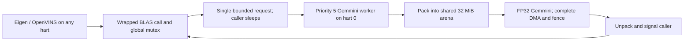

# FP32 Gemmini OpenBLAS

Validation is accepted on the corrected single- and quad-core FPGA images,
using the user-approved FPGA and focused RTL evidence. All nine FPGA cases
passed. The remaining full Verilator suites were retired: single-core is
interrupted/incomplete and quad-core was not started. See
[final validation scope](#final-validation-scope-2026-09-30-utc).
Earlier progress and diagnostic sections below retain their historical status.

The opt-in backend is `ILLIXR_LINALG_BACKEND=openblas_gemmini_fp32`.
The default remains Eigen. This backend uses FP32 Gemmini arithmetic for real
SGEMM/DGEMM and SGEMV/DGEMV, and the accepted RVV library for other operations.
DGEMM/DGEMV retain their double ABI but pack to float and widen the result.
This is a mixed-precision experiment, not an FP64 implementation.

## Dispatch and ownership

The interface adapter dispatches after OpenBLAS argument validation and before
GEMM forwarding, scratch allocation, or GEMV's original beta pre-scaling. The
original fork's direct float GEMM used an incorrect C stride, its float GEMV
did not implement general increments, and its Gemmini GEMV path applied beta
after an earlier CPU beta scaling. The replacement packs all logical matrices
and vectors explicitly, handles alpha/K zero without accessing product inputs,
and avoids reading old outputs when beta is zero. It performs no per-call heap
allocations and has no silent CPU fallback for nondegenerate GEMM/GEMV.

The caller owns the existing BLAS mutex and scratch lease while it waits. Only
the worker issues accelerator instructions. It remains preemptible with normal
timer interrupts; plugins remain scheduler-managed. Each call finishes DMA and
copies the output before releasing its buffers. The worker exits on normal
pipeline shutdown. A failed bounds/ownership check is fatal.

`ILLIXR_GEMMINI` records distinguish caller harts from accelerator execution,
and record operation dimensions, submissions, packing/unpacking time, queue
wait, execution interval/cycles, and scratch high-water use. These are aggregate
records exported through the existing trace path. Execution intervals can
include preemption; they are not accelerator-only hardware counters. Spike's
Gemmini extension is functional and supplies no hardware performance model.

## Revisions and hardware

- OpenBLAS: `6d12fcab91ebf4de5eb23c1218727d2551b8635e`; static, single-threaded,
  32-bit BLAS integers, no LAPACK/OpenMP/Linux runtime. RVV uses GCC 13.2 and
  preserves the existing eight-kernel TRMM compiler workaround.
- FP32 Gemmini generator: `8c3f9923a44a2fe2c7930587be297d6d4f8c09ca`, installed
  by `scripts/prepare_gemmini_generator.py` in the private
  `illixr_fp32_gemmini` Scala namespace. Package/reference renaming leaves
  literal resource paths intact; the manifest hashes every original and
  transformed file.
- The installed default Gemmini revision `69a1c0383283d6ac95c99d2e53136fef4b0bb67e`
  is an MX development branch. Its optional scaling-memory dereferences and
  asymmetric accumulator layout prevented this plain 4x4 FP32 configuration
  from elaborating. It is preserved for existing projects. The initial
  optional-memory patch was insufficient and is not in the accepted candidate.
- Hardware has one 4x4 FP32 Gemmini on hart 0, 32 KiB scratchpad, 8 KiB
  accumulators, full beta/scaling support, and custom3 instructions. Every
  Rocket retains Saturn REFV256D128. The two accepted Rocket interrupt fixes
  are retained. No Zephyr scheduler changes are included.

Single/quad FireSim configurations are in
`config/FireSimILLIXRGemminiSaturnConfigs.scala`; their shared hardware
configuration is `config/ILLIXRGemminiConfigs.scala`. Generated DTS, FIRRTL tile
instances, and Gemmini parameters are checked before synthesis. Firmware and
the private Spike extension consume the same generated header. The runner
rejects Gemmini firmware against an image without a matching header identity.

Clocks remain generated 500 MHz/500 kHz and modeled 1 GHz/1 MHz, with 10 kHz
Zephyr ticks, 256 MiB RAM, 30 MHz physical FPGA request, NORETIMING, and the
existing FASED settings. Verilator uses DRAMSim2, so cross-simulator performance
comparisons must identify the memory-model difference.

## Validation and current evidence

Results workspace:
`/scratch/prashanth_illixr_gemmini_20260929T160409Z`.

The standalone firmware under `tests/gemmini` links the production adapter and
BLAS fixtures without the ILLIXR plugins. Fixtures cover both precisions,
transposes, padding, signed strides, tile boundaries, alpha/beta edge cases,
overflow checks, competing callers, and forced caller migration. Exact dyadic
fixtures require exact results. Other FP32 fixtures use the predeclared bound
`gamma(4*k+12) * absolute_products + 32 * float_denorm_min`, with FP32 unit
roundoff `2^-24`; unaffected BLAS operations retain the existing FP64 limits.

The version-2 standalone Spike runs passed 610,297 checks on one hart and 610,745
on four harts, including 16 caller migrations in the quad case. The model
rejects Gemmini commands from any hart other than 0.

Version 2 adds 590 boundary/observed-size fixtures (46,552 exact checks):
zero M/N, alpha/K zero with null product inputs, beta zero with poisoned output,
signed GEMV strides, and 135x135 products with padding and transposition. The
largest products use exactly representable dyadic inputs and a closed-form
oracle, independently checked against host triple-loop BLAS with ASan/UBSan.
The fixtures also run through the production BLAS wrappers in the regular
preflight. A supplemental-only ELF (`ILLIXR_GEMMINI_EDGE_CASES_ONLY=ON`) lets
RTL execute these additional fixtures alongside the preserved original suite;
it does not replace the clock, vector-context, concurrency, or original BLAS
tests. Both ELF groups remain required for final acceptance. The user authorized
quad-core FPGA workloads while these RTL gates continue. Their production
backend sources and library archive identities are checked for equality.
Analyzers require the additional `ILLIXR_GEMMINI_EDGE` result for fixture
version 2 and continue accepting complete historical version-1 traces.

Both full Spike pipelines passed normal exit, full traces, 501 IMUs at both
consumers, camera accounting, prediction/transform checks, and the unchanged
1 mm / 0.001 rad native pose gate. The single-core case produced 17 VIO poses;
quad produced 25. Each had zero reported difference from native replay at the
exported pose precision and zero render/timewarp deadline misses. This does
not establish physical trajectory accuracy or FPGA speedup.

Both FPGA builds finished with routed timing closure (single WNS +0.077 ns;
quad +0.037 ns), verified hardware descriptions, and packaged drivers. The builds
ran concurrently; RTL test executions are sequential. Quad-core FPGA preflight
and the paired full workloads passed on 2026-09-30 UTC, following explicit user
authorization to run them while RTL validation continues. This changes execution
order only: full single/quad RTL gates and single-core FPGA cases were pending
at that stage. The corrected-hardware results below track subsequent validation.
Timeouts, resource stops, and incomplete traces cannot pass.

### Quad-core FPGA results

The same Rocket+Saturn+hart-0 Gemmini image, dataset, FASED configuration, modeled
1 GHz clock and 10 kHz ticks were used for both backends. Preflight passed all
610,745 BLAS checks, vector-context checks on hart mask `0xF`, and forced caller
migration. Both complete pipelines exited normally with complete traces, all
501 IMUs delivered to both consumers, valid initialized poses, and passing
native prediction/transform comparisons.

| Metric | RVV OpenBLAS | Gemmini FP32 OpenBLAS |
|---|---:|---:|
| VIO poses | 17 | 17 |
| Cameras processed / skipped / dropped | 19 / 0 / 31 | 19 / 0 / 31 |
| Native maximum position / rotation error at exported precision | 0 m / 0 rad | 0 m / 0 rad |
| Render / timewarp deadline misses | 0 / 0 | 0 / 0 |
| Fresh on-time presentations | 212 | 214 |
| Application time | 5.533378 s | 5.425060 s |
| Trace export time | 0.845163 s | 0.843102 s |
| DGEMM calls | 1,008 | 1,008 |
| Aggregate DGEMM elapsed time | 446.474 ms | 504.734 ms |
| Simulator host time (excludes programming/setup) | 269.9 s | 299.0 s |
| Host time including setup | 437.02 s | 459.61 s |

The 1,008 Gemmini submissions executed exclusively on hart 0; callers were
observed on all four harts. DGEMM packing took 340.459 ms, unpacking 93.032 ms,
queue wait 11.945 ms, and accelerator execution intervals 48.412 ms. Packing and
unpacking account for about 86% of total BLAS call time. Scratch high-water use
was 147,852 bytes within the reserved 32 MiB arena; the largest workload product
was 111x111x111. The preflight separately covers 135x135 products.

This pair demonstrates correctness, not a BLAS speedup: aggregate DGEMM latency
was about 13% higher with Gemmini. The application interval was about 2% shorter,
but the delivered camera indices and scheduling differed, so that is not an
isolated backend speedup measurement. All worker plugins processed data across
all four harts; the Gemmini call pattern concentrated more OpenVINS processing
on hart 0. Total target cycles also include different preflight suites and must
not be substituted for the application interval. Numerical agreement retains
the 1 mm / 0.001 rad limits and remains distinct from physical trajectory accuracy.

Evidence is under `runtime/firesim-quad-openblas_rvv-early` and
`runtime/firesim-quad-openblas_gemmini_fp32-early` in the results workspace.
`quad-paired-summary.json` verifies their artifact hashes and common controls;
`comparison.md` contains the full matrix and placement details. The matrix
coordinator revalidates these completed results after the RTL gates instead of
rerunning unchanged FPGA cases.

### RTL startup diagnosis and correction

The startup observer sampled PCs `0x800003cc`–`0x800003d2`, the firmware's
`memset` loop. The old standalone ELF placed the 32 MiB BLAS scratch arena in
BSS, causing a long CPU zero-fill before the Zephyr banner. The functional
Verilator model measured about 3,100 TestDriver counter increments per host
second (see the clock-domain distinction below).

The arena now uses Zephyr's `.noinit` storage: BLAS workspace has malloc-like
undefined initial contents, packing/kernels write their inputs, and explicit
initialization still writes every overflow canary. Its alignment, capacity,
allocation ownership, and bounds checks are unchanged. The standalone BSS
range decreased from `0x8007f000`–`0x820a1830` to
`0x8007ed00`–`0x8009f770`. The corrected
unmodified RTL model reaches the Zephyr banner within the one-million-cycle
startup diagnostic. A diagnostic cycle-limit exit is not a BLAS acceptance pass.

Both standalone and complete single/quad Spike gates passed again after this
change (`*-noinit` results). The generated Rocket interrupt regression passed
8,640 cases on each image. Both FPGA images passed final routed timing,
bus-skew, route completion and packaged-artifact checks. Full RTL BLAS and
the remaining matrix gates are still required. The four-host-thread single-core model
completed a 100,000-counter-increment benchmark in 12.80 seconds, compared with
34.92 seconds for the original. Target hardware and firmware are identical
across that host-performance comparison.

The subsequent quiet period after the banner was traced without changing
firmware or RTL. The observer saw `log_flush` call `z_impl_k_sleep` with 100
ticks, then the idle thread enter `wfi`. With 10 kHz ticks this is a 10 ms
modeled sleep. CLINT advanced from 150 to 175 while `mtimecmp` remained 10,100;
the clock-check workers had not started yet. This is an intentional logging
wait, not evidence of a scheduler deadlock. The uninterrupted full run later
emitted a passing `ILLIXR_CLOCK` record with hart mask 1, 2,048 atomic exchanges,
and a monotonic 1 MHz timer, confirming that it resumed. The CPU/timer ratio,
vector-context and complete BLAS gates remain pending.

The generated RTL uses an independent 2 ns Rocket/uncore clock and a 10 ns
TSI clock. The superseded four-host-thread TestDriver used a 1 ns `CLOCK_PERIOD`, so its printed
simulation-cycle count and `+max-cycles` counter increment twice per nominal
Rocket cycle. The observed CLINT progression is one tick per 2,000 TestDriver
increments, consistent with the generated 500 MHz / 500 kHz ratio. Firmware
interprets that ratio as 1 GHz / 1 MHz. Consequently, the logging sleep takes
about 20 million TestDriver increments (roughly 40 minutes at the measured
host rate). That model's 100-billion TestDriver limit is conservatively
50 billion nominal Rocket cycles; do not report it as 100 billion executed
CPU cycles. FireSim and Spike have separate counter semantics.

Read-only diagnostic evidence is preserved under
`runtime/verilator-startup-observed-t4-noinit-2m` and
`runtime/verilator-startup-timer-observed-t4-noinit-400k` in the results
workspace. These deliberately bounded diagnostics are not acceptance passes;
the complete standalone suite remains required.

The selected models now use a verified 2 ns TestDriver period, making the
100-billion reference-clock limit equal 100 billion nominal Rocket cycles.
Generated target RTL and firmware remain unchanged. Repeated host benchmarks
selected eight host threads for the single-core target and sixteen for the
quad-core target. The original full single test was preserved as incomplete
when replaced by the measured faster model; its remaining watchdog budget was
carried forward. The current full test was paused for the supplemental boundary
fixture and resumed with its state intact. That fixture passed 590 cases and
46,552 checks in RTL. It does not replace the still-pending full standalone suite.

### Standalone reference tables

A repeat of the unchanged quad FPGA preflight measured about 131 million target
cycles in vector checks, 986 million in Gemmini fixtures, and 422 million in the
remaining BLAS fixtures. These are approximate phase observations from buffered
UART and memory samples. Projecting its 1.616 billion total cycles at the
selected RTL models' measured rates gives 56–62 host hours, beyond the 24-hour
watchdog. FASED/DRAMSim2 and target activity can change that estimate.

`tests/gemmini` therefore has an optional `ILLIXR_GEMMINI_ORACLE_MODE`:

- `runtime` (default): the original scalar/Eigen reference calculations.
- `capture`: execute those calculations and export their FP64 bit patterns using
  buffered HTIF writes. All normal BLAS operations and checks still execute.
- `verify`: recompute the originals and compare every stored reference bit for
  bit. Both single- and quad-hart Spike verification passed.
- `table`: use the verified stored references, omitting only their computation.
  Both single- and quad-hart Spike table fixtures passed with the same numerical
  check counts, operation counts, dimensions, vector rounds, and migration tests.

The capture contains 253,728 product records and 151,296 values from 80 triangular
cases. Triangular inputs and parameters are fingerprinted before lookup; lookup
bounds, record metadata, final consumption counts, source hashes, and compiled
ELF identity are checked. Incomplete captures and mode mismatches are rejected.
All actual BLAS calls and the original FP32/FP64 acceptance bounds remain intact.
The preparation script creates standalone-only source copies in the build tree;
the production sources, OpenBLAS archive, estimator and pipeline firmware remain
unchanged. The table-based quad standalone ELF uses 111,075,088 bytes of its
256 MiB RAM region, including the configured heaps and scratch arena.

Use `ILLIXR_GEMMINI_ORACLE_CAPTURE` to identify a completed capture console and
pass its `compiled_manifest.json` to `run_gemmini_standalone.py --oracle-manifest`.
The first unbuffered capture is preserved as incomplete; it produced no usable
reference table. The buffered capture passed in 16.9 host seconds. Its exact
values were subsequently verified on both hart counts before enabling table mode.
The first table-based quad FPGA preflight failed the FP64 BLAS self-test while
passing the Gemmini FP32 fixtures, vector-context checks, and table integrity
checks. It completed at 813,420,002 target cycles with explicit failure status.
This fixture is not accepted as an RTL replacement. Both an operation-logging
diagnostic and a buffered-failure-only diagnostic passed all 610,745 checks with
interrupts enabled. Neither proves that the original failure is fixed: their
code layout and timing differ. Two exact-ELF repeats both failed at the original
813,420,002-cycle exit point. A diagnostic copy with 24 bytes changed preserves
all code/data addresses and traps at the first failed FP64 comparison; it is
not eligible for acceptance. That diagnostic and separate six-byte DTRMM-only
and DTRSM-only breakpoint variants also passed without trapping. They preserve
layout but still change timing, so the original failure remains unresolved.
A private diagnostic now repeats the complete fixture sixteen times with small
busy-wait offsets and buffered mismatch capture, retaining every check and
keeping interrupts enabled. It is not an acceptance case. The buffered-capture
feature compiles out of normal builds: object code, constants, symbols and
relocations match the prior object byte-for-byte after stripping debug metadata.
An independent host scalar calculation of
all 151,296 triangular-reference entries also passed the unchanged FP64 bound
(maximum absolute difference 1.11e-15). The original RTL run was subsequently
stopped and preserved as incomplete when the corrected models replaced it; no
pending RTL case is counted as a pass by this optimization. These results do not invalidate
or replace the separately preserved production quad FPGA pipeline results.

The sixteen-phase sweep completed with fifteen passing phases and one failing
phase (phase 3, following a 21 us diagnostic delay). All sixteen Gemmini FP32
phases passed 300,857 checks each. The failing FP64 operation is DTRSM on an
81-by-83 matrix with `LLTN` flags: left side, lower triangular input, transpose,
non-unit diagonal. There were 32 FP64 comparison failures; the bounded log
preserves the first sixteen, beginning at row 0, column 82. Their largest
captured absolute error is 0.00675691188300509, well beyond the unchanged FP64
tolerance. The oracle validation passed in all phases. This is a reproduced
numerical failure, not a small rounding discrepancy or a passing optimized gate.

A follow-up private diagnostic captures the actual triangular matrix, actual
right-hand side immediately before this solve, and the complete output of its
first failure. The capture changes timing and remains diagnostic-only. On the
quad FPGA this variant did not finish its first FP64 phase: the target clock
advanced beyond ten billion cycles while console output stopped and external
memory traffic was nearly flat. The owned diagnostic was interrupted and is
incomplete; this is not proof of a hardware deadlock. The same capture logic
completed all sixteen phases on quad Spike without a numerical failure. The
host solver has a regression test for this exact shape and transpose, including
a single residual in the last column.

A private diagnostic compared the original internal RVV DGEMM return
path, a `fence rw,rw` after that kernel, and a 64-NOP delay after that kernel
across sixteen complete-fixture phases. Interrupts stay enabled and all original
checks remain. Action counters verify that each selected control executes.
All sixteen phases passed on both quad Spike and quad FireSim (eight baseline,
four fenced, four delay-only), with 2,892 internal kernel dispatches per phase.
The FPGA sweep completed 10,619,720,002 target cycles in 378.8 driver host
seconds. Because every baseline also passed, this comparison is inconclusive:
the control code changes timing/layout, and no fence fix is established.
An unchanged repeat of the earlier phase-sweep ELF reproduced phase 3's
32 errors with identical first-sixteen actual/expected bit patterns. All sixteen
phase records matched, and both runs ended at 10,684,730,002 target cycles. Fitting those sixteen observed errors to a
single erroneous triangular equation identifies row 31, column 82: its inferred
residual, 0.5589792060491487, matches the omitted contribution of rows 32–80,
0.5589792060491493. The fit's maximum difference is 2.11e-15 and predicts 32
incorrect output rows. This is a hypothesis from partial captured output, not
a complete matrix capture or proof of the underlying ordering/interrupt cause.

A new private capture copies A, reference RHS R, and actual output only after a
failed solve. It performs no pre-solve matrix copy. R had already been compared
to the actual pre-solve input using the unchanged FP64 tolerance; it is explicitly
not labeled as exact input bits. The host analysis tracks that uncertainty.
This diagnostic passed all sixteen phases on quad Spike. On FPGA it reproduced
32 errors in phase 10's `LUNN` solve, with the first sixteen incorrect values
bit-identical to the earlier `LLTN` failure. The capture filter selected only
`LLTN`, so no full matrix was saved. Both flags select the same upper-triangular
kernel path here, and this fixture's coefficients are symmetric (lda 83 is 1
modulo the value generator's period 41). The next isolated capture covers all
failing left-side 81-row solves.

A separate private kernel diagnostic executes the existing `dgemm_kernel` with
M=8, N=1, K=49 using packed coefficients from the implicated update. An assembly
wrapper reads its last output lane after 0–96 NOPs, with and without a fence;
a second observation checks all eight output values after a fence. It covers
sixteen cache-line/page-boundary alignments and all four harts, with interrupts
enabled and timer callbacks observed. All 24,832 calls and 273,152 comparisons
passed on quad Spike. The FPGA diagnostic completed with five stale immediate scalar reads, all in
unfenced cases crossing a 4 KiB boundary; harts 1 and 3 observed failures.
All post-fence memory values were correct, as were every fenced first read.
The stale value was 2.2111531190926277 instead of 1.6521739130434785, matching
the pre-update value. This distinguishes visibility from an incorrect final
computed result in the focused test. These checks are supplementary and cannot
replace the complete BLAS or ILLIXR gate.

The generated Saturn `VectorMemUnit` reproduces an address-bound defect:
336 of 1,008 scalar-dependency checks failed for pending loads/stores resumed
on the next page. `op.page` refers to the active translated page, but the
lower bound used the original `op.base_offset` without `vstart`/`segstart`.
For an eight-lane FP64 access starting at offset 0xff0, the second slice has
`vstart=2` and accesses offsets 0x000–0x02f on the next page. The old dependency
range instead began at 0xff0 there, allowing conflicting scalar accesses.

The isolated candidate patch `patches/saturn-cross-page-dependency.patch`
computes the active lower offset before both scalar and vector overlap checks.
It retains the existing conservative upper bound. It changes dependency
tracking, not the address generator, FP arithmetic, estimator, or scheduler.
`tests/saturn_mem_order/run_rtl.py` tests the real generated module, without
replacing its logic. The preserved old-hardware result is an expected-failure
negative control, not a passing hardware gate. Corrected source snapshots are
under the results workspace's `saturn-page-fix-20260930T040237Z` directory.
Re-elaboration, positive RTL regression, routed timing, and FPGA validation
are required before accepting this patch across the complete matrix.
No library fence workaround was introduced. Detailed evidence is in the results
workspace's `control/oracle-fp64-diagnosis.json` and
`runtime/firesim-quad-oracle-table-phase/phase-analysis.json`.

The broader post-failure capture completed all sixteen phases. Phases 13 and 15
failed (`LUNU` and `LUNN`); the captured phase-13 solve contains 32 wrong
outputs, all in column 82, with one large equation residual at row 31:
0.5589792060491487. This matches the missing update from the focused kernel
diagnostic. Matrix A and output were captured exactly; RHS is the independent
reference, whose comparison against the actual input passed before execution.
The residual exceeds that input uncertainty bound by approximately 4 billion.
This strengthens the visibility diagnosis without treating the saved reference
RHS as the actual input bits. Both production FPGA workloads remain valid passes
for their delivered input sequences; their operation summaries contain 1,008
DGEMM calls and zero triangular-solve calls.

The candidate now passes the actual regenerated RTL in both single- and quad-core
configurations: 1,008 basic checks and 39,984 extended checks per configuration,
with zero failures. The extended suite covers segmented and whole-register
scalar hazards and vector store-to-load ordering in both age orders. Its same
driver failed 29,120 checks on the original generated RTL. The generated DTS
contents and Gemmini parameter headers are byte-identical to the corresponding
original builds. These RTL results do not substitute for routed timing or
FPGA numerical validation.

### Corrected single-core FPGA results (2026-09-30 UTC)

The corrected single-core build and all four assigned FPGA cases completed.
Final setup/hold slack is +0.068/+0.009 ns, with zero failing setup, hold, or
pulse-width endpoints. All 501,185 routable nets are routed, and all 28 bus-skew
constraints pass. The packaged bitstream archive SHA-256 is
`3cad0e3e1d3ea36ca97bc917ec3beb78fc788ec2376b1e61280850debf7c39e8`.

Preflight passed 610,297 BLAS checks, the additional 46,552 edge checks, clock
and atomic checks, and FP64 vector-context checks with hart mask `0x1` and
`vlenb=32`. The focused kernel regression passed 6,208 calls and 68,288
comparisons, including the unfenced cases, with zero immediate-read, final
memory, or guard errors. Interrupts remained enabled and timer events occurred
in both fence groups. This focused test uses the same source as the quad
reproducer, compiled for one hart; it is supplementary to the full preflight.

| Metric | RVV OpenBLAS | Gemmini FP32 OpenBLAS |
|---|---:|---:|
| VIO poses | 11 | 13 |
| Cameras processed / skipped / dropped | 13 / 11 / 26 | 15 / 22 / 13 |
| IMUs received by each consumer | 501 | 501 |
| Native maximum position / rotation error at exported precision | 0 m / 0 rad | 0 m / 0 rad |
| Completed renders / warps | 612 / 612 | 639 / 639 |
| Render / timewarp deadline misses | 0 / 0 | 0 / 0 |
| Fresh on-time presentations | 75 | 184 |
| Application time | 5.108399 s | 5.333422 s |
| Trace export time | 0.802425 s | 0.871098 s |
| DGEMM calls | 990 | 976 |
| Aggregate DGEMM elapsed time | 190.725 ms | 789.724 ms |
| Largest DGEMM M / N / K | 75 / 75 / 75 | 87 / 87 / 87 |
| FireSim total target cycles | 6,573,350,002 | 7,794,870,002 |
| Host time including setup | 391.786 s | 438.409 s |

Both complete pipelines exited normally with complete traces, initialized
finite poses, and passing native estimator, prediction, transform, timestamp,
quaternion, and presentation checks. Native limits remain 1 mm / 0.001 rad;
zero reported difference is at exported precision. The delivered camera
sequences and matrix dimensions differ, so these aggregate results do not
isolate a backend speedup. All 976 Gemmini submissions executed on hart 0.
Their aggregate packing/queue/execution/unpacking intervals were
189.823/371.276/25.575/57.460 ms; scratch high-water use was 90,828 bytes.
Runtime equivalence does not establish physical trajectory accuracy.

Evidence is under `saturn-page-fix-20260930T040237Z/runtime/` in
`corrected-single-preflight`, `corrected-single-kernel-update`,
`corrected-single-openblas_rvv`, and `corrected-single-openblas_gemmini_fp32`.
The focused diagnostic's generic runner deliberately remains ineligible for a
full-fixture pass; `diagnostic-analysis.json` records its narrower passing result.

Two orchestration issues were resolved before programming: the finalizer now
reads the successful separate elaboration log and verifies its generated RTL
hash against the unit regression, and copied runtime-configuration symlinks
were preserved before linking the private configuration. Memory capacities,
runtime settings, bitstream, firmware, and acceptance limits were unchanged.
The failed review records and repairs are preserved in the corrected workspace's
`control/` directory.

### Corrected quad-core FPGA results (2026-09-30 UTC)

All five assigned quad-core FPGA cases completed by 10:01 UTC. Final setup/hold
slack is +0.106/+0.009 ns, with zero failing setup, hold, or pulse-width endpoints.
All 985,514 routable nets are routed, and all 28 bus-skew constraints pass.
The packaged bitstream archive SHA-256 is
`1cea7f705d828f98f90f47812cad60065b608574ec6103ec1fc2662e3102b1ba`.
Preflight passed 610,745 BLAS checks and the additional 46,552 edge checks.
Vector-context checks exercised hart mask `0xF`, VLEN 256, FP64, and 16 migrations
with zero errors. Startup clock/atomic checks also exercised all four harts.

The original failing kernel ELF was reused byte for byte. Its 24,832 calls and
273,152 comparisons now pass on all four harts, including unfenced immediate
reads with interrupts enabled. The previous image produced five stale-read
errors with that same ELF. The unchanged 16-phase full-fixture ELF also passes
all phases and reference-table checks, where the previous image failed phase 3.
Both diagnostics exited normally. These results confirm the correction for the
reproduced failures; the focused diagnostic remains supplementary to full
pipeline and RTL acceptance. The before/after hashes and results are in
`saturn-page-fix-20260930T040237Z/control/quad-failure-regression-comparison.json`.

| Metric | RVV OpenBLAS | Gemmini FP32 OpenBLAS |
|---|---:|---:|
| VIO poses | 17 | 17 |
| Cameras processed / skipped / dropped | 19 / 0 / 31 | 19 / 0 / 31 |
| IMUs received by each consumer | 501 | 501 |
| Native maximum position / rotation error at exported precision | 0 m / 0 rad | 0 m / 0 rad |
| Completed renders / warps | 662 / 662 | 651 / 651 |
| Render / timewarp deadline misses | 0 / 0 | 0 / 0 |
| Fresh on-time modeled presentations | 212 | 214 |
| Application time | 5.525088 s | 5.433390 s |
| Trace export time | 0.878622 s | 0.873863 s |
| DGEMM calls | 1,008 | 1,008 |
| Aggregate DGEMM elapsed time | 444.603 ms | 498.647 ms |
| Largest DGEMM M / N / K | 111 / 111 / 111 | 111 / 111 / 111 |
| FireSim total target cycles | 7,077,010,002 | 7,928,940,002 |
| Host time including setup | 440.162 s | 461.653 s |

Both complete pipelines passed the unchanged numerical, trace, prediction,
transform, quaternion, timestamp, sample-accounting, and presentation checks.
All six worker plugins recorded actual processing on all four harts. Gemmini
issued all 1,008 accelerator submissions on hart 0; caller counts were
857/68/46/37 across harts 0/1/2/3. Its aggregate packing/queue/execution/unpacking
intervals were 337.883/9.239/48.240/92.498 ms; scratch high-water use was 147,852
bytes. Intervals include preemption. RD-cycle aggregates exclude migrated calls;
the global-timer elapsed intervals include every call.

Gemmini's aggregate DGEMM latency was about 12.2% higher in this pair, while its
application interval was about 1.7% shorter. The delivered camera sequences
differ: for example, RVV emitted a pose for camera 25 while Gemmini used camera
24. These observations do not isolate a backend speedup. Total target cycles
also include startup/self-tests and trace export, not just VIO work.

Physical trajectory accuracy remains a separate limitation. Over the shared
ground-truth interval, both runs estimate about 0.406 m endpoint displacement
versus about 0.00144 m in ground truth. This displacement-magnitude diagnostic
does not align coordinate frames and is not a calibrated trajectory-error
metric. Matching the unchanged native estimator does not remove this drift.

All nine corrected FPGA cases and both hardware manifests were independently
audited in `saturn-page-fix-20260930T040237Z/control/corrected-fpga-evidence-audit.json`.
The single/quad generated Saturn unit regressions, supplemental RTL edge suites,
and generated Rocket interrupt regressions have passed.

### Final validation scope (2026-09-30 UTC)

After reviewing the corrected FPGA results, the user explicitly accepted FPGA
and focused RTL evidence and retired the remaining full Verilator requirement.
The single-core full RTL run was stopped after about 10 hours and is preserved
as interrupted/incomplete. Its startup and vector-context checks passed, but
its BLAS suite did not finish. The quad-core full RTL suite was not started.
Neither full RTL suite is counted as passing.

The accepted evidence comprises both timing-closed FPGA images, all nine FPGA
cases (including four complete ILLIXR pipelines), the unchanged failing-binary
regressions, 40,992 generated Saturn checks per configuration, 8,640 generated
Rocket interrupt checks per configuration, and both supplemental RTL edge
suites. Native limits remain 1 mm / 0.001 rad, with no estimator or calibration
changes. Acceptance covers the tested configurations and workloads; the
physical trajectory limitation described above remains.

The user decision, revised requirements, and final evidence audit are preserved
under `saturn-page-fix-20260930T040237Z/control/` as
`user-accepted-fpga-focused-rtl.json`, `acceptance-requirements-v2.json`, and
`final-acceptance-audit.json`. Earlier pending-RTL audits remain historical.
