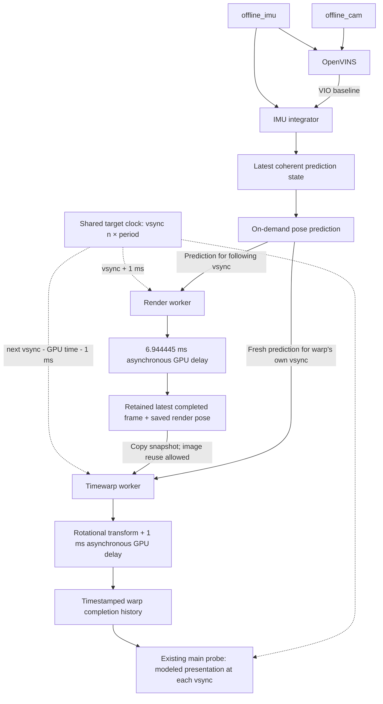

# Pose prediction and asynchronous GPU model

The `gpu_pipeline` profile adds an on-demand pose-prediction service and two
independent Zephyr workers to the existing IMU, camera, OpenVINS, and IMU
integrator pipeline. The default placement is scheduler-managed.



Prediction is a service called independently by the two workers, as in the
desktop implementation. It does not wait for new sensor or VIO publications.
The integrator publishes a value snapshot containing its state and the last two
bias-corrected IMU readings, with angular rates adapted to the predictor's
quaternion convention. Snapshot copying is protected by a short mutex;
prediction math runs outside shared locks. A separate short lock protects the
common orientation offset and each consumer's stale-pose cache.

The renderer creates one immutable 64×64 RGBA image per eye at startup. These
checkerboard/gradient images have distinct eye markers. Each frame records a
prediction for its intended display deadline and a reference to those images.
The worker then sleeps until its simulated GPU completion time and publishes a
completed frame. No scene is rendered and the image does not depend on the pose.

Render and timewarp use independently scheduled workers. Render normally wakes
1 ms after a display boundary and predicts for the following boundary. Timewarp
wakes 2 ms before its own upcoming boundary, copies the latest completed image
descriptor, requests a new prediction for that boundary, and computes the
existing rotational correction using the immutable saved render orientation.
The same image may be warped again with a newer pose. Neither worker waits for
the other; short mutexes protect descriptor copies and publication only.

Both GPU operations are modeled with blocking target-clock sleeps. **No shaders,
image resampling, translation, or depth reprojection run; pixels stay unchanged.**
The schedule follows native OpenGL's independent vsync-paced workers, with the
explicit GPU-time-plus-margin policy selected for this port instead of the
desktop timewarp's literal 90% sleep rule. Desktop `gldemo` reads `vsync_estimate`
and applies its 1 ms safety offset; `timewarp_gl` retains the latest `eyebuffer`.
Here, a shared virtual display clock replaces swap-buffer-derived vsync estimates.

The main consumer/probe models presentation without adding a display worker. At
each nominal vsync it chooses the newest warp publication timestamp no later
than that boundary. If nothing new is eligible, the previous output persists;
before the first eligible completion, there is no output. A bounded completion
history allows a delayed observer to reconstruct past boundaries without
selecting future work. Observer lateness is recorded separately. These events
are a model of presentation, not physical scanout measurements.

## Configuration and clocks

| CMake setting | Default | Meaning |
| --- | ---: | --- |
| `ILLIXR_DISPLAY_HZ` | 120 | Shared absolute display phase for both workers |
| `ILLIXR_RENDER_OFFSET_NS` | 1,000,000 | Render wake after vsync |
| `ILLIXR_TIMEWARP_MARGIN_NS` | 1,000,000 | Margin added to timewarp GPU delay before vsync |
| `ILLIXR_RENDER_DELAY_NS` | 6,944,445 | Simulated elapsed rendering time |
| `ILLIXR_TIMEWARP_DELAY_NS` | 1,000,000 | Simulated elapsed timewarp time |

Both GPU delays release the CPU. The model permits rendering and timewarp to
overlap and does not model shared GPU capacity, contention, command queues,
shader cost, or bandwidth. These are configurable workload assumptions, not
measured GPU performance.

The shared target timer determines elapsed time; host time and instruction
counts do not drive the workers. The Rocket/FireSim baseline models a 1 GHz CPU
and declares a 1 MHz timer, preserving the generated hardware's 1000:1 ratio.
The default delays correspond to approximately 6.94 million and 1 million target cycles.
The accepted FPGA hardware is unchanged. FASED latency settings remain in cycles.
Spike retains its configured 10 MHz timer. Zephyr defaults to 10 kHz ticks (100 µs),
so observed worker wakeups can be later than the scheduled completion instant.
Both timestamps are retained. Sleeps recheck the clock before recording
completion, preventing a completion from being reported early.

`build_rocket.sh` selects `config/rocket_1ghz.conf` by default. Set
`ILLIXR_MODELED_CLOCK_SCALE=1` to build the earlier 500 MHz / 500 kHz model;
override `CONFIG_SYS_CLOCK_TICKS_PER_SEC` to reproduce the earlier 1 kHz tick.
Runner cases record clock settings from the firmware manifest and check them
against compiled settings before execution. Previous artifacts retain their
original clock interpretation. See [clock experiments](clock-experiments.md).

The final workload summary measures `trace_export_start_ns`, `trace_export_end_ns`,
and `trace_export_ns` around the bulk console dump after worker shutdown. This
separates application time from the expensive trace output; the final diagnostic
and summary lines are outside that measured span. FireSim's total target cycles
include startup, application work, trace export, and exit. Host wall time also
includes deployment and simulator overhead.

Frame deadlines and GPU timestamps use elapsed runtime nanoseconds. Prediction
targets and source IMU timestamps use the dataset epoch, obtained by adding the
shared dataset origin. Prediction returns the current state at zero horizon,
rejects negative horizons, and freezes the consumer's last valid prediction
when the horizon exceeds 50 ms. Frozen poses are marked stale; before the first
valid pose the identity fallback is marked explicitly.

The period is integer nanoseconds (`8,333,333` at 120 Hz). Offsets must be
nonnegative and smaller than a period, and timewarp delay plus margin must fit
inside a period; invalid builds fail static assertions. Rendering skips expired
opportunities. A warp waking after its target vsync records missed opportunities
and advances to the next future wake. Workers never run catch-up bursts. Once
submitted, work retains its original prediction target even when completion or
publication misses that deadline. Publication lateness and GPU completion
lateness are both reported.

After the four sensor/tracking workers finish, render completes any in-flight
GPU work and closes its retained publication. Timewarp performs a final scheduled
opportunity, selecting the last completed frame, then stops. If no frame exists,
that opportunity is empty and terminates without waiting for an image. The main
observer advances through the first boundary at or after the final warp
publication (or final empty opportunity). Normal completion accounts for:

```text
render submitted = render completed = distinct selected frames + never selected frames
timewarp submitted = timewarp completed = first uses + repeated uses
display slots = new output + repeated output + no output
```

All image, snapshot, completion-history, trace, and prediction storage is bounded. No per-IMU,
prediction, frame, or timewarp allocation is introduced. Both new workers have
priority 5 and 64 KiB stacks. The seven plugins comprise six workers and one
on-demand service; startup barriers count workers rather than plugins.

## Provenance and validation

The prediction kernel and CPU timewarp transform come from
[`pcg108/ILLIXR`](https://github.com/pcg108/ILLIXR/tree/c9f4b6864d058211cb555a96bffa0e8c689001ca),
commit `c9f4b6864d058211cb555a96bffa0e8c689001ca`. The relevant desktop sources are
`plugins/pose_prediction/plugin.cpp`,
`plugins/headless_timewarp_vk/plugin.cpp`, and `include/illixr/math_util.hpp`.
The source copyright and license for the timewarp port are retained in
[`plugins/timewarp/LICENSE`](../plugins/timewarp/LICENSE).

GPU trace **version 2** separates `frame_id`, `warp_id`, and `display_slot`.
`ILLIXR_GPU_EVENT` includes scheduled/actual wake, selection, submission, scheduled
GPU completion, observed completion and publication times, prediction target,
frame age since render publication/reuse, saved render pose, transform, and processing/publication harts.
`ILLIXR_WARP_SLOT` accounts for submitted, empty, and missed opportunities
(compact ranges for misses). `ILLIXR_DISPLAY` records eligibility-based output
selection, observer lateness, and fresh on-time presentation.
`ILLIXR_GPU_RESULT` provides the accounting totals and lifecycle timestamps.

The analyzer dispatches legacy/version-1 traces to the original checks. Version 2
checks independent schedules, unique warp IDs, retained latest frame selection,
unchanged render poses, fresh service invocations, deadline misses, completion
eligibility, and full presentation/EOS accounting. Native transform comparison
uses unique warp IDs, allowing repeated frame IDs. All workload runs require at
least one fresh, on-time modeled presentation; other deadline misses are reported
separately. The slow-render case additionally requires image reuse with a valid
prediction from a newer IMU state. Prediction status, 50 ms horizon, and stale
pose behavior remain unchanged.

The native GPU test compiles the actual snapshot, schedule, presentation and wait helpers against a
small host synchronization adapter. It exercises concurrent replacement,
repeated snapshots and final-frame closure, independent progress during waits, cancellation,
and no early completion. It extracts the reference transform directly from the
desktop source and checks 512 rotations with Eigen heap allocation disabled:

```sh
python3 plugins/timewarp/tests/run_native_tests.py \
  --desktop /home/prashanth/illixr-pcg108 \
  --output /path/to/results/gpu-native-tests
```

The host adapter does not validate Zephyr scheduling or SMP behavior. Complete
dual- and quad-core Spike runs, followed by quad-core FireSim, provide that
evidence. Tests require actual fresh predicted frames completing timewarp,
preserved sensor accounting, and the existing native VIO comparison. GPU
deadline performance is reported separately from functional correctness.

The angular adapter preserves the existing integrator's orientation evolution.
Let `q_H` be its Hamilton G-to-I quaternion and `R_H` its rotation matrix.
The snapshot exports `conjugate(q_H)` for the desktop JPL convention and
exports **both gyro endpoints as `-R_H * corrected_gyro`**, using the current
snapshot rotation. The existing integrator has `R_dot = R_H [gyro]x`; the
desktop predictor has `R_dot = -[predictor_gyro]x R_H`. The rate conversion makes
those derivatives agree. Conjugating only the quaternion reverses the angular
continuation; negating only the gyro still fails for general tilted orientations.
The native test exercises the same adapter used by the integrator against an
independent constant-rate continuation, over identity, tilted, and noncommuting
orientations and horizons from 1 to 50 ms. Neither integration kernel changes.

Numerical agreement verifies execution of the copied prediction/transform
kernels, not agreement with the complete desktop trajectory or physical
accuracy. The desktop GTSAM integrator and its filters are not ported. The
existing RTOS integrator and its known trajectory drift, including its gravity
sign behavior, remain unchanged; the copied predictor retains the desktop
`+9.81` gravity convention. The angular adapter changes the exported quaternion
and rate convention, not the world frame, accelerometer samples, position, or
velocity. It establishes instantaneous and constant-rate angular continuity;
time-varying rates retain the kernels' different integration and interpolation
schemes, and it does not resolve the existing gravity inconsistency. Stale
output during bounded-dataset drain is expected and is counted rather than
silently extrapolated for seconds.

## Building and running

Keep the dependency/toolchain checkout at its existing location and select
separate build and artifact directories. For example, with `work` pointing at
a new results directory on scratch:

```sh
ILLIXR_PROFILE=gpu_pipeline ILLIXR_BUILD_DIR="$work/builds/spike-dual" \
  ILLIXR_ARTIFACT_DIR="$work/artifacts/spike-dual-50" \
  bash scripts/build_spike.sh dual 50
ILLIXR_PROFILE=gpu_pipeline ILLIXR_BUILD_DIR="$work/builds/spike-quad" \
  ILLIXR_ARTIFACT_DIR="$work/artifacts/spike-quad-50" \
  bash scripts/build_spike.sh quad 50
ILLIXR_ROCKET_WORK="$work" ILLIXR_BUILD_DIR="$work/builds/rocket-quad" \
  ILLIXR_ROCKET_PLATFORM=/home/prashanth/illixr-rocket-work/simulators/QuadRocketConfig-platform.json \
  bash scripts/build_rocket.sh quad scheduler -DYAML_FILE="$PWD/profiles/gpu_pipeline.yaml"
ILLIXR_PROFILE=gpu_pipeline ILLIXR_BUILD_DIR="$work/builds/spike-dual-slow-render" \
  ILLIXR_ARTIFACT_DIR="$work/artifacts/spike-dual-slow-render-50" \
  bash scripts/build_spike.sh dual 50 -DILLIXR_RENDER_DELAY_NS=16666666
python3 scripts/run_gpu_pipeline.py --work "$work" --include-slow-render --stage spike --execute
python3 scripts/run_gpu_pipeline.py --work "$work" --include-slow-render --stage firesim --execute
```

When a firmware correction requires a new work directory, preserve the previous
directory and optionally place `revision-history.json` in the new directory:

```json
[
  {
    "name": "Earlier prediction snapshot adapter",
    "description": "Corrected angular-rate frame/sign mapping at the predictor input; existing integrator and prediction equations remain unchanged.",
    "evidence": "/absolute/path/to/previous-work/results/pipeline-comparison.md"
  }
]
```

The generated comparison and JSON summary label these entries `superseded` and
link their preserved evidence separately from the current validation cases.
These notes do not make previous results eligible for reuse or change acceptance
checks. An optional `status` string can provide a more specific history label.

The recorded validation builds additionally run through the existing resource
guard with eight workers and lower scheduling priority. Builds refuse to
overwrite existing firmware artifact directories. Runner attempts also
preserve prior results; `--spike-attempt N` selects a new pair of Spike output
directories and must be passed consistently when checking the FireSim gate.
The Spike ISA includes `Zicntr`, required by the platform check's `rdcycle`.
FireSim uses the existing accepted quad-core hardware and preflight firmware,
checks board availability, and holds the shared runtime lock.

## Validated display-schedule results

See [the completed Spike/FireSim validation](opengl-scheduling-results.md) for frame reuse,
modeled presentation, deadline misses, actual hart placement, native agreement,
and separate application/trace-export timing.
