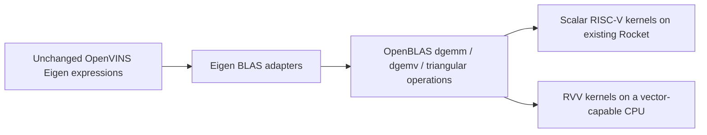

# Eigen, OpenBLAS, and RVV feasibility

Investigated 2026-09-27. This is a feasibility assessment with isolated compile
probes, not an enabled or runtime-validated backend. Application sources,
accepted firmware, and FPGA images were not changed by this investigation.

## Conclusion

Eigen can route operations in the existing RTOS estimator to OpenBLAS without
rewriting estimator equations. The supplied OpenBLAS fork has double-precision
RVV kernels for those operations. Using them in ILLIXR RTOS requires both a
Zephyr-compatible library build and an RVV-capable execution platform.

| Execution platform | Scalar OpenBLAS | RVV OpenBLAS |
|---|---|---|
| Current Rocket / accepted FireSim hardware | ISA compatible; runtime integration remains | Unsupported by the hardware ISA |
| Current Spike launch configuration | ISA compatible; runtime integration remains | V is not currently enabled |
| Spike with V enabled | Possible | Candidate for functional validation after library/kernel integration |
| Future vector-capable Chipyard design | Possible | Requires compatible RVV version, FP64 vector support, VLEN, and a new validated bitstream |

The accepted quad-core hardware description reports
`rv64imafdcbzicsr_zifencei_zihpm_zfh_zba_zbb_zbs_xrocket`, without V. Raising its
modeled clock frequency does not add vector instructions.

## References and provenance

- OpenVINS fork: `bfcca5ba442532bf0e1f5d2a27083da343cd6328`.
- OpenBLAS fork: `6d12fcab91ebf4de5eb23c1218727d2551b8635e`.
- Local Eigen: 3.4.1.
- Local ucb-bar Zephyr: `cd45a528d3bf81f9c7aa2a63f9fe512eee0881b0`.
- Isolated sources, commands, compile logs, object files, disassembly, and hashes:
  `/scratch/prashanth_illixr_firesim_20260926/blas-feasibility-20260927T160838Z`.
- Hardware evidence:
  `/scratch/prashanth_illixr_firesim_20260926/control/hardware-4.json`.
- Compile commands were derived from the accepted batched-trace build at
  `/scratch/prashanth_illixr_firesim_20260926/batch-traces-20260927T071032Z/builds/rocket`.

## How the two repositories connect

The [OpenVINS CMake file](https://github.com/zekailin00/OpenVINS/blob/bfcca5ba442532bf0e1f5d2a27083da343cd6328/CMakeLists.txt)
defines `EIGEN_USE_BLAS=1`, adds OpenBLAS as a dependency, and links
`openblas_static`. Its cross-build also selects `RISCV64_GENERIC` and defines
`GEMMINI_BACKEND`. That is not the desired RVV configuration.

In this OpenBLAS fork, `GEMMINI_BACKEND` diverts GEMM into Gemmini operations;
the double-precision branch allocates float buffers and converts inputs and
outputs. Leave this macro **undefined**, not defined to zero: the source tests
`defined(GEMMINI_BACKEND)`. This path does not preserve our precision constraint.
See [the GEMM interface](https://github.com/zekailin00/OpenBLAS/blob/6d12fcab91ebf4de5eb23c1218727d2551b8635e/interface/gemm.c).

For RVV 1.0, explicitly select `RISCV64_ZVL128B` for VLEN >= 128 bits, or
`RISCV64_ZVL256B` for VLEN >= 256 bits, with double-precision vector arithmetic.
The [128-bit target mapping](https://github.com/zekailin00/OpenBLAS/blob/6d12fcab91ebf4de5eb23c1218727d2551b8635e/kernel/riscv64/KERNEL.RISCV64_ZVL128B)
selects `dgemm_kernel_8x4_zvl128b.c`, `gemv_n_rvv.c`, and `gemv_t_rvv.c`.
`RISCV64_GENERIC` selects scalar kernels. `C910V` is the older RVV 0.7.1 target
and should not be substituted for the RVV 1.0 targets.

GEMM and GEMV are library operations implemented using sequences of vector
instructions, not individual RVV instructions.

## Compile evidence

| Probe | Result |
|---|---|
| Existing `SLAMMath.cpp`, existing Zephyr SDK/flags, adding only `EIGEN_USE_BLAS=1` and redirecting output | Compiles; undefined BLAS references include `dgemm_`, `dgemv_`, `dtrmm_`, `dtrmv_` |
| RVV FP64 intrinsic snippet, Zephyr SDK 0.17.0 / GCC 12.2 | Fails: `riscv_vector.h` unavailable |
| Same snippet, installed Chipyard bare-metal GCC 13.2 | Compiles |
| Fork CMake cross-configuration, Generic OS, static single-threaded ZVL128B, no LAPACK | Configures successfully |
| Actual DGEMM kernel and both DGEMV kernels with that configuration | Compile; disassembly contains vector setup and FP vector multiply-accumulate instructions |
| OpenBLAS allocator and DGEMM interface with embedded macro | Compile, with warnings retained in logs |

The probes do not establish full archive build, Zephyr linking, runtime
correctness, or performance. Kernel probes use Chipyard's compiler and its
headers; compatibility with the application's Zephyr/Newlib ABI still needs
verification. Warnings include duplicate `DTB_DEFAULT_ENTRIES` and an implicit
`num_cpu_avail` declaration in the single-threaded GEMM interface. The compiled
single-threaded interface object has no unresolved `num_cpu_avail` reference.

## Proposed RTOS integration

1. Add an optional backend setting with Eigen-only, scalar OpenBLAS, and RVV
   OpenBLAS variants. Preserve the currently validated Eigen-only baseline.
2. Build a static BLAS-only library. Use `USE_THREAD=OFF`, `USE_OPENMP=OFF`,
   `DYNAMIC_ARCH=OFF`, `NOFORTRAN=ON`, `BUILD_WITHOUT_LAPACK=ON`,
   `BUILD_STATIC_LIBS=ON`, `BUILD_SHARED_LIBS=OFF`, `BUILD_TESTING=OFF`, and
   `INTERFACE64=OFF`. Use the existing `lp64d` calling convention and medany
   code model. BLAS dimensions remain 32-bit: local Eigen's `BlasIndex` is `int`.
3. Supply a Zephyr/bare-metal toolchain configuration. The fork's supplied
   toolchain targets Linux and contains machine-specific paths. Its
   `EMBEDDED=ON` option also injects Cortex-M4 compiler flags, so it is not a
   ready-made RISC-V switch. The configure probe instead used a Generic system
   and explicit `-DOS_EMBEDDED`. A production port must audit initialization,
   allocation, environment queries, libc dependencies, and error paths.
4. Budget bounded, aligned scratch memory before enabling the backend.
   `common_riscv64.h` specifies a 32 MiB allocation buffer, substantial within
   our 256 MiB target. Do not assume that changing a kernel heap setting budgets
   Newlib malloc correctly. Audit scratch allocation and peak application RAM;
   reduce blocking/buffer settings only with corresponding correctness tests.
5. Define `EIGEN_USE_BLAS=1` before Eigen is included, with consistent definitions
   across translation units sharing Eigen template instantiations. Link the
   static library into the final Zephyr ELF, not only the plugin object target.
   Review common headers before scoping the macro only to VIO to avoid differing
   inline/template definitions. If other workers also call BLAS, provide
   Zephyr-compatible serialization/locking; single-threaded BLAS does not by
   itself guarantee concurrent-call safety. Keep estimator kernels synchronous
   inside the existing OpenVINS worker, without adding BLAS worker threads.
6. Leave `EIGEN_USE_LAPACKE` disabled. Eigen's BLAS option routes supported
   products, while LAPACKE is a separate decomposition backend. Keep the current
   decomposition algorithms and FP64 precision. See the
   [Eigen backend documentation](https://libeigen.gitlab.io/eigen/docs-nightly/TopicUsingBlasLapack.html).
7. For RVV, use a compiler supporting the fork's `__riscv_*` intrinsics. The
   installed GCC 13.2 is a viable library compiler candidate, but mixing its
   runtime dependencies with the GCC 12.2 application needs an ABI/link audit.
   A consistent compatible Zephyr toolchain is another option. Compile the
   ZVL128B library with `-march=rv64gcv -mabi=lp64d`; ZVL256B additionally requires
   the matching minimum vector-length extension. Keep explicit platform ISA
   requirements rather than relying on desktop CPU autodetection.
8. Enable V in the Spike/platform configuration and Zephyr
   `CONFIG_RISCV_ISA_EXT_V`, retaining `CONFIG_FPU_SHARING`. The pinned Zephyr
   fork already has vector register/CSR save and restore code integrated with
   its FP ownership logic; new scheduler code is not an assumed prerequisite.
   Validate first use, timer preemption, simultaneous vector users, and migration
   between harts, with an adequate vector context save area for the chosen VLEN.
   Source presence is not evidence that these paths have passed our tests.
9. Run on FPGA only after selecting vector-capable hardware, verifying its ISA
   and FP64 support, building new hardware, and passing platform preflight.

## Validation and expected benefit

Start with scalar BLAS to isolate library/runtime integration from RVV. Test
matrix dimensions, transposes, strides, and triangular operations represented
by the real estimator, then compare the same delivered input sequences against
the existing native harness at 1 mm / 0.001 rad. Follow with multicore RVV Spike
and a dedicated vector context-preservation test. Spike establishes functional
behavior, not representative RVV hardware speedup.

Dynamic covariance augmentation, innovation covariance, Kalman-gain products,
and covariance updates are candidates. Small fixed-size IMU operations and
feature tracking will not all become BLAS calls. Measure calls and dimensions,
VIO processing time, processed/dropped cameras, output poses, and render/timewarp
deadlines on real modeled hardware. More VIO poses or fewer missed frames are
possible outcomes, not established results. Scalar OpenBLAS could be slower
for this workload; RVV gains depend on vector hardware and memory behavior.

Estimator equations, calibration, initialization, and dataset remain unchanged.
Changing the multiplication backend can still change floating-point reduction
order, so numerical agreement must be tested rather than assumed bitwise.
